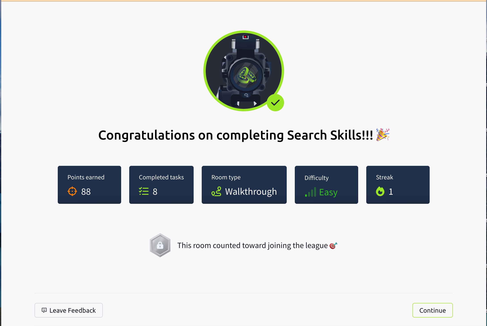

## TryHackMe: Active Directory Basics

## 실습 일시
 - 2025-07-29, 2025-10-20

## 실습 주제
(1) Introduction
 - 마이크로소프트 사의 액티브 디렉토리는 기업 세계에서 척추와 같은 역할을 한다.
 - 액티브 디렉터리는 기업 환경에 연결되어 있는 기기들이나 사용자들의 관리를 간단하게 해준다.
 - 이번 모듈에서의 목표는 다음과 같다.
   1) 액티브 디렉터리란 뭔지
   2) 액티브 디렉터리 도메인이란 뭔지
   3) 액티브 디렉터리의 구성요소는 무엇인지
   4) Forests and Domain Trust
   5) And much more
  
(2) Windows Domains
 - 우리가 네트워크 사업을 하고 있다고 생각해보자. 네트워크의 구성원이 다섯 명뿐이라면 네트워크에 문제가 생길 시 우리는 바로바로 그 문제점을 고칠 수 있다.
 - 하지만 네트워크의 구성원이 많으면 많아질수록 등록되어 있는 기기가 많으면 많아질수록 그러한 관리가 어려워질 것이란 건 예상하기 쉽다.
 - 이러한 한계를 극복하기 위해 우리는 윈도우 도메인을 사용할 수 있다.
 - 윈도우 도메인이란 그룹에 속해 있는 여러 사용자와 컴퓨터들을 묶어서 관리할 수 있게 하는 도구로 이러한 도메인은 액티브 디렉터리(AD:Active Directory)라는 하나의 저장소를 가진다.
 - 액티브 디렉터리를 실행하고 관리하는 서비스를 Domain Controller(DC)라고 부른다.
 - 윈도우 도메인을 가질 때의 주된 장점은 다음과 같다.
   1) 중앙집중적인 개체 관리 : 네트워크의 구성원들은 적은 노력으로 기기를 관리할 수 있다.
   2) 보안 정책 관리 : 사용자는 액티브 디렉터리를 통해서 보안 정책을 직접적으로 구성할 수 있고 네트워크를 통해 곧바로 적용시킬 수 있다.
 - 액티브 디렉터리는 실생활에서 자주 쓰이는데 대표적인 것 중 하나가 학생증을 통한 학교 출입 시스템이다.

(3) Active Directory
 - 윈도우 도메인의 핵심은 Active Directory Domain Service(AD DS)이다.
 - 이 서비스는 네트워크 내에 존재하는 모든 개체들의 정보를 카탈로그화 해준다.
 - Users : 사용자는 액티브 디렉터리에 존재하는 가장 흔한 개체 중 하나이다. 사용자는 보안 원칙으로 알려진 개체 중의 하나로, 그 이유는 사용자는 도메인으로부터 권한을 받거나 파일이나 프린터들 같은 자원들을 사용할 권리를 갖기 때문이다. 사용자는 크게 다음과 같은 엔티티로 나타내어진다.
   1) People : 사용자는 직원과 같이 조직에서 네트워크에 접속이 필요한 개인으로 대표된다.
   2) Services : 유저를 IIS나 MSSQL 같은 서비스를 사용하는 사용자로 정의할 수 있다. 이러한 식으로 정의된 사용자는 보통 사용자와는 다르며, 이들은 오직 서비스를 실행시키는 권한만을 갖는다.
 - Machines : 모든 컴퓨터가 액티브 디렉터리 도메인에 접속할 때, 머신 오브젝트는 생성된다. 머신 또한 보안 원칙 오브젝트로 취급되며 보통 사용자 계정과 같은 권한을 같지만 몇몇에 대해서는 제한된 권리를 가진다. 머신 계정은 로컬 관리자 계정이기에 패스워드를 알고 있지 않은 한 이 컴퓨터 이외로는 접속할 수 없다. 머신 계정의 패스워드는 자동적으로 갱신되는 120글자의 난수로 이뤄져 있다. 이러한 머신 계정을 알아내는 것은 비교적 쉬운데 이러한 계정은 특별한 작명법을 가진다. 머신 계정은 항상 컴퓨터 이름 뒤에 달러 표시를 갖는다.
 - Security Groups : 윈도우에서는 사용자들을 여러 그룹으로 나눠 그룹에 따라 파일이나 폴더에 대한 권한을 부여할 수 있다. 이러한 조치들은 기존 그룹에 사용자를 추가할 때 높은 응용성을 발휘할 수 있다. 시큐리티 그룹도 네트워크를 통해 각종 자원들에 관한 권한을 가진다. 그룹은 사용자와 머신을 구성원으로 둘 수 있다. 몇몇 그룹들은 도메인에 디폴트적으로 생성된다.
   1) Domain Admins : 모든 도메인에 대한 접근 권한을 가진 사용자들이 있는 관리자 그룹이다. DC를 포함한 모든 컴퓨터, 도메인을 관리할 수 있다. 
   2) Server Operators : 도메인 컨트롤러를 관리할 수 있는 사용자들의 그룹이다. 관리 그룹 멤버를 바꿀 권한은 없다.
   3) Backup Operators : 이 그룹의 사용자들은 모든 파일들에 대해 권한을 무시하고 접근할 수 있다. 데이터 백업을 할 시 사용한다.
   4) Account Operators : 이 그룹의 사용자들은 도메인의 계정을 만들거나 수정할 수 있다.
   5) Domain Users : 도메인에 존재하는 모든 사용자 계정을 포함시킨다.
   6) Domain Computers : 도메인에 존재하는 모든 컴퓨터를 포함시킨다.
   7) Domain Controllers : 도메인에 존재하는 모든 도메인 컨트롤러를 포함시킨다.
 - Acitve Directory Users and Computers : 우리가 사용자나 그룹 머신을 만들기 위해서는 도메인 컨트롤러에 로그인하고 'Active Directory Users and Computers'를 실행시킬 필요가 있다. 이러한 서비스를 이용하면 도메인에 존재하는 사용자 계정이나 그룹, 컴퓨터의 관계를 알 수 있다. 이러한 객체들은 Organizational Units(OUs)를 통해 조직되어진다. 이 서비스는 비슷한 보안 정책을 사용할 때 편의성을 위해 사용한다. 다음은 이러한 OU 서비스에서 기본적으로 생성되는 컨테이너들의 목록이다.
   1) Builtin : 윈도우 호스트로 사용할 수 있는 디폴트 그룹들을 포함한다.
   2) Computers : 네트워크에 참여하는 머신들은 기놉적으로 전부 여기에 포함된다. 만약 너가 필요하다면 옮길 수 있다.
   3) Domain Controllers : 네트워크에 있는 기본적인 도메인 컨트롤러를 포함한 OU(Organizational Unit)이다.
   4) Users : 도메인 와이드를 적용한 기본적인 사용자와 그룹들이다.
   5) Managed Service Accounts : 윈도우 도메인에서 서비스되는 계정들을 갖고 있는다.
 - 그룹과 OUs는 사용자와 컴퓨터들을 구분한다는 역학을 가지고 있지만 그 목적에 대해서는 완전히 다르다.
 - OUs는 사용자와 컴퓨터에 정책을 적용하는 것을 쉽게 하기 위함이다.
 - Security Groups은 자원을 넘나들고 권한을 주기 위해 사용한다.

(4) Managing Users in AD
 - 도메인 관리자의 첫일은 존재하는 액티브 디렉터리의 사용자들을 찾는 일이다.
 - Deleting extra OUs and users : 일단 AD에 없는 다른 OU(Organizational Unit)이 있는지 확인해봐야 한다. 있고 사용을 하지 않는다면 예산 상의 이유로라도 삭제해야 한다. 만약 사용하는 것을 의도치 않게 삭제한다면 다시 만들어야 한다.
 - Delegation : 액티브 디렉터리에서 할 수 있는 일 중 하나는 특정 사용자에게 제어권을 줄 수 있다는 점이다. 도메인 관리자의 도움 없이 사용자에게 권한을 부여할 수 있다.

(5) Managing Computers in AD
 -  기기들을 관리하는데 중요한 것은 그들을 분리하고 조직화하는 것이다. 적어도 3가지로 분류하는데 다음과 같다.
    1) Workstations : 액티브 디렉터리 도메인에서 가장 흔한 기기 중 하나이다. 도메인에 있는 각각의 사용자들은 워크스테이션에 로그인되어 있다. 워크스테이션은 사용자들의 작업이나 평소의 웹브라우징을 수행하는 기기이다.
    2) Servers : 서버는 액티브 디렉터리 영역에서 두번째로 흔한 기기이다. 서버는 주로 사용자나 다른 서버에 서비스를 공급하는 역할을 한다.
    3) Domain Controllers : 도메인 컨트롤러는 액티브 디렉터리 영역에서 세번째로 흔한 기기이다. 도메인 컨트롤러는 액티브 디렉터리 영역을 관리할 수 있게 해준다. 사용자 계정 보안에 소소하지만 손을 보탠다.
   
(6) Group Policies
 - 지금까지 사용자의 컴퓨터들은 여러가지 Ou로 나누었다. 그 주된 목적은 각각의 Ou에 개별적인 정책을 부여하는 데 있다. 이렇게 함으로써 우리는 사용자에게 각 부문에 맞는 인증과정과 보안 기준을 설정할 수 있다.
 - 윈도우 운영체제는 그러한 정책들을 'Group Policy Objects(GPO)'를 통해 관리한다.
 - GPO는 간단하게 말하면 각 Ou들의 세팅 정보들의 집합이다.
 - GPO는 사용자들이 사용하는 각 기기들과 개체들의 보안 기준선과 정책들을 포함한다.
 - GPO를 알아보기 위해 우리는 윈도우 시작 메뉴에 있는 'Group Policy Management'를 사용한다.
 - GPO는 SYSVOL라 불리는 네트워크를 통해서 네트워크 전반에 분산되어 있다.
 - 네트워크에 있는 GPO에 변경점이 있다면, 각 기기가 이것을 알아차리는 데는 최대 2시간이 소요된다.
 - 만약, 즉각적으로 변경점을 업데이트하고 싶으면 다음과 같은 명령어를 터미널에 입력해야 한다. PS C:\> gpupdate /force 
 
(7) Authentication Methods
 - 윈도우 도메인을 이용할 때, 모든 인증서들은 도메인 컨트롤러에 저장된다. 만약 사용자가 이러한 인증서를 사용하는 서비스에 접근할 때, 서비스는 도메인 컨트롤러에 사용자가 적절한 사용자인지 판별을 요청한다.
 - 윈도우 도메인에서 네트워크 인증에 주로 사용하는 프로토콜은 다음 두가지이다.
   1) Kerberos : 최근 윈도우 버전에서 사용하고, 가장 기본적으로 설정되는 프로토콜이다.
   2) NetNTLM : 호환성 떄문에 사용하는 인증 프로토콜이다.
 - NetNTLM이 쓸모없게 될 때까지 대부분의 네트워크에서는 둘 모두 사용하였다.
 
(8) Kerberos Authentication
 - Kerberos 인증은 윈도우의 어떤 버전에서나 기본적인 인증 프로토콜이다.
 - 커버로스를 이용하여 로그인한 사용자는 티켓을 부여받는다. 이 티켓들은 이전 인증의 증거물로 활용된다. 그렇기에 이 티켓을 소유한다는건 사용자가 이전에도 서비스에 인증받았다는 것을 보여준다.
 - 커버로스 인증 과정은 다음과 같다.
   1) 유저이름과 키를 통해 암호화된 타임스탬프를 Key Distribution Center(KDC)에 전송한다.
   2) KDC가 Ticket Granting Ticket(TGT)를 생성하고 사용자에게 돌려준다. 이를 줌으로써 세션키도 동시에 사용자에게 보내진다.
   3) 사용자가 데이터베이스와 같은 서비스에 접속하고 싶을 때 TGT는 KDC에 Ticket Granting Service(TGS)에 대해 요청한다. 이를 위해 사용자는 KDC에 사용자 이름과 세션키로 암호화된 타임스탬프를 같이 보낸다.
   4) 그 결과, KDC는 사용자에게 TGS와 Service Session Key를 주고, 사용자는 그를 이용해 원하는 서비스에 접속을 한다.

(9) NetNTLM Authentication
 - NetNTLM 인증은 challenge-response 매커니즘을 사용하여 진행한다.
   1) 사용자가 접속하고자 하는 서버에 인증 요청을 보낸다.
   2) 서버가 무작위수를 생성하고 클라이언트에게 챌린지로 전송한다.
   3) 사용자는 소유하고 있는 NTLM 패스워드 해시값과 챌린지값을 결합하여 인증을 위해 사용하는 반응값을 생성한다.
   4) 서버는 챌린지값과 반응값을 Domain Controller에 보내고 인증을 요청한다.
   5) DC는 챌린지값을 이용해 반응값을 재계산하고 이를 원본과 비교하여 비교 결과를 서버에 전송한다.
   6) 서버는 비교 결과를 사용자에게 전송한다.
 - 사용자의 암호(혹은 해시값)은 변경되지 않는다.

(10) Trees, Forests and Trusts
 - 기업이 작을 때는 하나의 도메인만을 가지고 관리가 가능할 수 있지만 기업이 커지면 하나의 도메인 만으로는 한계가 생긴다.
 - 운좋게도, 액티브 디렉터리는 여러 개의 도메인의 통합을 지원한다. 우리는 여러 개의 도메인들을 Tree라는 이름의 시스템에 통합시킨다.
 - 

(11) Conclusions

## 사용 도구 및 명행령어   
 - 명령어를 사용하지 않았다. 
   

## 배운 점
 - 'filetype:', 'site:' 등 특정 파일 타입만을 보이게 하거나 사이트를 국한해서 검색하는 등 검색엔진의 다양한 활용법에 대해 배웠다.
 - 쇼단과 Censys등 평소에 접해보지 않았던 사이트를 접해보고 경험해보았다.
 - 우리가 흔히 사용하는 소셜 미디어의 최신 정보를 빨리 알 수 있고 트렌드를 파악할 수 있다는 순기능도 배웠다.

## 실무 적용 가능성
 - 오늘 검색 엔진 부분에서 배웠던 여러 가지 조건들을 걸고 찾는 방식은 실무에서 자표를 찾을 때 요긴하게 써먹을 수 있을 것 같다.
 - Shodan, Censys, Virustotal 같은 사이트들은 실무에서 파일이나 폴더에 바이러스가 있을 때 확인하거나 취약점이 발생되었을 때 어떤 취약점인지 찾기 위해서 사용할 것 같다.

## 느낀 점
 - 이번에 배운 내용들은 새로운 카테고리에 있는 내용들이라 그런지 신선했고 배운다는 느낌이 났다.
 - 우리가 당연하게 생각해왔던 정보들의 출처를 확인하라 신뢰할 만한지를 확인하라 를 다시 읽으면서 배우니 정말 중요하다는 것을 느꼈다.
 - 정보보안기사 준비 시 '쇼단'에 대한 내용이 나오는데 그래서 그런지 친근하게 느껴졌다.
   
## 실습 화면 기록

