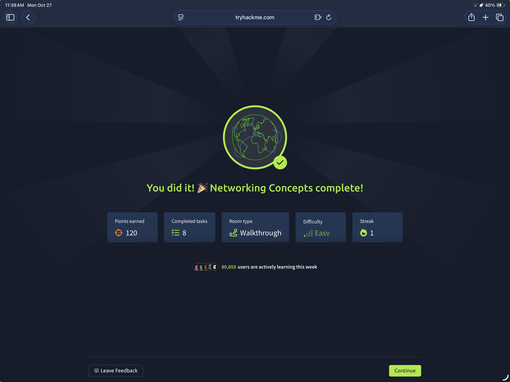

## TryHackMe: Windows PowerShell

## 실습 일시
 - 2025-11-3~12

## 실습 주제
(1) Introduction
 - PowerShell : 마이크로소프트사에서 제공하는 업무 자동화와 관리를 담당하는 프로그램으로 명령어 쉘과 스크립트 언어로 이루어져 있다.
 - 이번 장에서 배울 학습 목표들은 다음과 같다.
   1) PowerShell이 뭔지와 그 기능에 대해
   2) PowerShell과 그 언어의 기본 구조에 대한 이해
   3) PowerShell에 대한 기본적인 명령어 실습
   4) 정보보안 산업에 있어서 PowerShell의 응용과 활용
      
(2) What is PowerShell
 - 파워쉘은 마이크로소프트사에서 개발한 업무 자동화와 구성을 관리하는 도구이다. 명령어 인터페이스와 스크립팅 언어의 결합으로 이루어져 있다.
 - 오래된 텍스트 기반 명령어 툴과 다르게, 파워셀은 개체 지향적인 도구이다.
 - 파워쉘은 윈도우용으로 시작되있지만 시간이 지나면서 맥이나 리눅스 운영체제에서도 사용할 수 있도록 확장하였다.
        
(3) PowerShell Basics
 - 파워셀 실행과 간단한 메뉴 설명
   1) Start Menu : 윈도우 시작 메뉴에 있는 검색창의 파워쉘 버전이다.
   2) Run Dialog : 실행 목록을 보여주는 메뉴이다.
   3) File Explorer : 폴더의 네비게이터이다. 우리가 아는 윈도우 디렉터리 파인더의 파워쉘 버전이다.
   4) Task Manager : 작업관리자는 여는 메뉴이다.
 - 파워쉘 명령어는 cmdlets(command-lets)로 잘 알려져 있다. 이건 전통적인 윈도우 명령어보다 더 강력하고 데이터 조작시에 여러가지 고급 옵션들을 제공해준다.
 - 기본적인 cmdlets
   1) Get-Command : 파워쉘에서 사용할 수 있는 명령어들의 목록을 보여준다.
   2) Get-Help : 명령어의 쓰임새, 파라미터값, 사용예시 등을 알려준다.
 - 파워쉘의 강력한 특징 중 하나는 추가적인 cmdlets나 온라인 저장소를 다운로드 받아 사용하여 기능을 확장하는데 있다.   

(4) Navigating the File System and Working with Files
 - Get-ChildItem : 윈도우의 dir, 유닉스의 ls와 같은 역할을 하는 명령어로 디렉터리와 경로를 보여주며 디렉터리나 컨텐츠를 찾는 역할을 한다.
 - Set-Directory : 윈도우의 cd와 비슷한 역할을 하는 명령어로 다른 디렉터리로 가는 역할을 한다.
 - New-Item : 새로운 디렉터리나 파일을 생성하는 명령어이다.
 - Remove-Item : 디레거리나 파일을 제거하는 명령어이다.
 - Get-Content : 윈도우의 type, 유닉스의 cat 명령어와 같은 역할로 파일이나 디렉터리의 내용을 읽고 보여준다.

(5) Piping, Filtering, and Sorting Data
 - UDP(User Datagram Protocol) : 간단한 비연결형 프로토콜로 전송 계층에서 동작한다. 비연결형이기에 연결이 필요 없고 그렇기에 내가 보낸 패킷이 잘 도착했는지 알 방법이 없다.
 - TCP(Transmission Control Protocol) : 연결 지향적인 전송 프로토콜이다. 데이터 전송 전에 연결을 수립할 필요가 있고 그에 맞게 안전한 데이터 전송을 보장한다. TCP 연결은 3-way handshake라는 다음의 과정을 거쳐 수립된다.
   1) SYN Packet : 클라이언트가 서버에게 SYN(Synchronise)패킷을 보냄으로써 연결을 시도한다. 이 패킷은 클라이언트가 정한 시작 시퀸스 번호를 가진다.
   2) SYN-ACK Packet : 서버는 SYN패킷에 대한 응답으로 클라이언트에게 SYN-ACK 패킷을 보낸다. 이 패킷에는 시퀸스 번호 뒤에 서버가 정한 무작위 번호가 추가된다.
   3) ACK Packet : 클라이언트는 SYN-ACK Packet의 회답으로 서버에게 ACK(Acknowledge)패킷을 보내고 3-way handshake과정이 끝났음을 알린다.
   cf) 

(6) System and Network Information
 - 이번 장에서는 다른 주요 컨셉인 캡슐화(Encapsulation)에 대해서 배울 것이다. 이 개념은 간단히 말하자면 데이터가 층을 지나가면서 점점 정보들을 가진 헤더가 붙는 것이다.
 - 캡슐화는 크게 다음과 같은 네가지 과정을 거친다.
   1) Application data : 이 과정은 우리가 애플리케이션에 데이터를 보내는 모든 경우에 발생하며, 무슨 프로토콜이 사용되었는지와 같은 부가적인 정보를 첨부시킨다.
   2) Transport protocol segment or datagram : TCP, UDP 등이 있는 전송 계층에서는 정보를 담고 있는 헤더인 TCP segment, UDP datagram을 첨부시켜 네트워크 계층으로 보낸다.
   3) Network packet : 이 계층에서는 받은 TCP segment 혹은 UDP datagram에 IP헤더를 붙여서 데이터 링크 계층으로 보낸다.
   4) Data link frame : 이더넷과 와이파이가 IP패킷을 받고 적절한 헤더와 트레일러를 첨부시켜 프레임을 만든다.
 - 

(7) Real-Time System Analysis
 - telnet(Teletype Network)은 원격 터미널 연결을 하는 네트워크 프로토콜이다.
 - 이번 실습 시에 목표로 할 서버는 다음 세가지이다.
   1) Echo server : 이 서버는 사용자가 보낸 모든 것을 널리 퍼뜨리게 한다. 7번 포트를 사용한다.
   2) Daytime server : 13번 포트를 기본적으로 사용하고 현재 날짜와 시간을 응답한다.
   3) Web(HTTP) server : 기본적으로 TCP 80번 포트를 사용하고 웹페이지를 제공한다.
 - telnet targetIPAddress PortNumber : telnet 접속 명령어 

(8) Scripting
 - 이제까지 뭘 배웠는지에 대한 간단한 복습
   
(9) Conclusion
## 사용 도구 및 명행령어   
 - ipconfig : 자신의 ip주소를 보여준다.
 - 
 - telnet 10.201.94.181 7 : Echo server 에 접속한다.
 - telnet 10.201.94.181 13 : Daytime server에 접속한다. 서버는 시간을 보여주고 자동으로 접속을 종료시킨다.
 - telnet 10.201.94.181 80 : 해당 웹페이지로 접속한다.

   
## 배운 점
 - 대부분 학교에서 배웠거나 정보처리기사를 준비할 때 배웠던 내용이라 새롭게 배웠던 내용은 없었던 것 같다.
 - 나는 원래 Transport Layer의 단위가 세그먼트인 줄 알았는데 TCP, UDP에 따라 세그먼트, 데이터그램으로 명칭이 바뀌는 것인 줄 처음 알았다.

## 실무 적용 가능성
 - 이번 실습에서 다룬 TCP, UDP 그리고 포트 개념은 향후 시스템 보안 점검이나 네트워크 트래픽 분석 시 필수적인 기반 지식이다.
 - telnet은 보안 취약점 때문에 실무에서 직접 사용되진 않지만, 네트워크 트러블슈팅 시 포트 접근 테스트 용도로 여전히 유용하다.

## 느낀 점
 - 이미 배웠던 내용들을 다시 배우니 복습한다는 느낌이 많이 들었다. 잊어버렸던 내용들도 다시 보니 많이 생각이 났고 내용 이해가 예전보다는 쉽게 되었다.
 - 기본적인 내용이지만, 이 단계를 통해 상위 개념(패킷 분석, 포트 스캐닝)의 토대를 명확히 다질 수 있었다.
 - 앞으로 이 내용을 기반으로 실제 패킷 캡처, 포트 스캔, 방화벽 규칙 분석까지 실습을 확장할 생각이다.

   
## 실습 화면 기록

