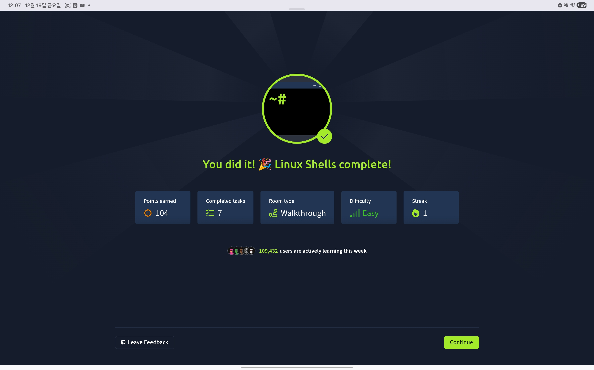

## TryHackMe: Linux Shells

## 실습 일시
 - 2025-12-15~19

## 실습 주제
(1) Introduction to Linux Shells
 - 대부분의 사용자들은 그래픽 기반 인터페이스를 이용하여 필요한 작업들을 수행한다. 눈으로 보고 클릭을 하고 좌클릭이나 우클릭으로 옵션을 변경하면 대부분 작업이 끝나있기 때문이다.
 - 이러한 작업들은 GUI(그래픽 기반 인터페이스)로도 해결할 수 있지만 CLI(명령문 기반 인터페이스)로도 해결할 수 있다. 리눅스와 같은 운영체제의 조작에 한해서는 CLI가 더 효과적이다.
 - 이번 학습에서 배울 것들
   1) 리눅스쉘을 이용한 상호작용
   2) 기본적인 쉘 명령어 사용하기
   3) 사용 가능한 리눅스쉘 유형 탐색하기
   4) 간단한 쉘스크립트 짜보기

(2) How To Interact With a Shell?
 - pwd : 현재 작업 중인 디렉터리를 출력하는 명령어
 - cd name: name 디렉터리를 작업 디렉터리로 바꾸는 명령어
 - ls : 현재 속해 있는 디렉터리의 파일이나 폴더를 보여주는 명령어
 - cat : 파일의 내용을 읽을 수 있게 해주는 명령어 
        
(3) Types of Linux Shells
 - echo $SHELL : 현재 사용 중인 쉘이 무엇인지를 보여준다.
 - cat /etc/shells : /etc/shells 폴더에 설치되어있는 쉘의 목록을 보여준다.(cat : 해당 파일이나 폴더의 내용을 보여주는 리눅스 명령어)
 - history : 현재 세션에서 이전에 사용한 명령들을 볼 수 있는 명령어이다.4
 - chsh -s <Directory> : 쉘을 바꾸는 명령어
 - Bourne Again Shell(Bash) : 리눅스에서 가장 기본적이고 유용한 쉘
 - Friendly Interactive Shell(Fish) : 이름 그대로 사용자 친화적인 쉘이다.
 - Z Shell(Zsh) : 사전에 설치되어 있는 쉘은 아니지만 여러 쉘들의 기능이 결합되어있어 현대적이고 기능적인 쉘이다.   

(4) Shell Scripting and Components
 - 쉘을 이용해서 스크립트를 짜는 방법을 배워볼 것이다.
 - Variables
   1) nano first_script.sh : 파일 이름이 first_script인 Shebang파일을 만들어낸다.
   2) echo "Hey, what's your name? : 이름이 무엇인지 물어보는 문장을 출력한다.
   3) read name : 이름을 입력 받는다.
   4) echo "Welcome, $name" : 사용자가 입력한 이름을 변수에 저장하고 저장한 변수와 같이 출력한다.
   5) chmod +x first_script.sh : 해당 파일에 대해 사용자에게 실행 권한을 추가시킨다.
 - Loops
   1) for i in {1..10}; : 변수 i를 만들고 10번 반복하는 반복문을 만든다.
   2) do : 반복문의 시작을 알리는 코드이다.
   3) echo $i : 변수 i의 값을 출력한다.
   4) done : 반복문의 종료를 알리는 코드이다.
 - Conditional Statments
   1) echo "Please enter your name!" : 이름을 적으라는 문장을 출력한다.
   2) read name : 사용자가 입력한 값을 name이란 변수를 만들어 여기에 저장한다.
   3) if [ "$name" = "Stewart" ]; then : 조건문의 조건을 명시한다. 조건이 맞았을 시에 다음 문장이 실행된다.
   4)  echo "Welcome Stewart! Here is the Secret: THM_Script" : 설정된 문장을 출력한다.
   5) else : 조건이 맞지 않았을 때의 실행될 코드를 말한다,
   6)  echo "Sorry! You are not authorized to access the secret." : 설정된 문자을 출력한다.
   8) fi : 조건문의 종료를 알리는 코드이다.
 - Comments
   1) # : 말하려는 문자 앞에 이것을 붙이면 해당 줄의 문장은 주석처리가 된다.
 
(5) The Locker Script
 - 이름, 회사 이름, 핀번호 4자리를 사용자에게 입력받고 조건문을 통해서 출력문을 달리하는 간단한 코드

(6) Practical Exercise
 - sudo ./flag_hunt.sh : 루트계정으로 해당 파일을 실행. 권한을 다 무시하고 열 수 있다.

(7) Conclusion
 - 이제까지 뭘 배웠는지에 대한 간단한 복습

## 실무 적용 가능성
 - 리눅스에 사용하는 간단한 명령어부터 쉥에 대한 조작 명령어, 리눅스에서 스크립트를 작성하는 법까지 배웠는데 현장에서는 리눅스를 많이 쓴다고 하니 오늘 배운 지식은 잊어버리더라도 금방 다시 떠올릴 수 있게 해야한다.
 - 현장에서 컴파일러로 무엇을 쓸지는 알 수 없지만 컴파일러 없이도 스크립트를 작성할 수 있는 능력을 현장에서 중요하게 볼 것 같다.  

## 느낀 점
 - 요즘 너무 스크립트 작성같은 것을 등한시해서 작성하는데 어려움이 많았다.
 - 리눅스에 대해 기초적이고 개념적인 것만 배웠는데 이렇게 쉘을 통해서 실습을 하니 예전 처음 코딩했을 때가 생각났다.
 - 요즘 들어 정보보안이라는 진로에 대해 의구심이 많이 생겼으나 이번 실습으로 인하여 그러한 의구심이 조금은 해소된 느낌이 들었다.
    
## 실습 화면 기록

