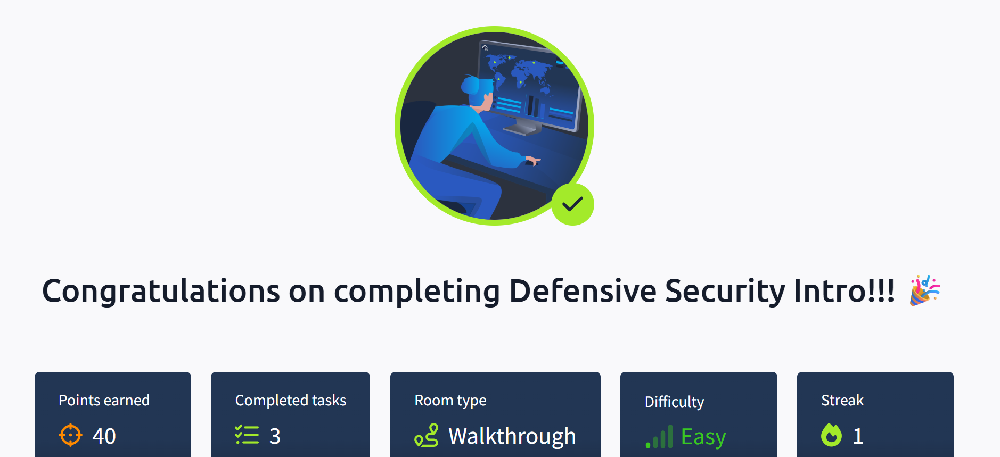

## TryHackMe:[Intro] Security Operations & Offensive Tooling Basics

## 실습 일시
- 2025-05-12 (수정날짜 : 2026-01-30)

## 실습 주제 및 내용
### 1) Security Operations Center (SOC)
 - 취약점 분석과 정책 위반과 승인되지 않은 활동 탐지를 주로 하는 정보보안 전문가들의 집합이다.

### 2) Threat Intelligence
 - 현존하는 혹은 잠재적인 적에 관한 정보(Intelligence), 시스템에 해를 끼치는 행위(Threat)이다.
 - 회사를 더 좋게 하기 위해서 잠재적 적에 대한 정보를 모으는 행위이다.

### 3) Digital Forensics and Incident Response (DFIR)
  1. Digital Forensics
  - 포렌식이란 범죄의 증거를 조사하기 위한 응용과학의 한 분야로, 디지털 포렌식은 사이버 범죄의 증거를 컴퓨터나 스마트폰에서 조사하는 포렌식의 한 종류이다.
  - 증거는 주로 파일시스템, 시스템 메모리, 시스템 로그, 메모리 로그에서 찾는다.
  2. Incident Response
  - 사이버 공격을 당했을 때, 따라야 할 메뉴얼이나 어떻게 대처해야 할지를 명시한 방법론이다.
  - 공격에 의한 피해를 최소화하거나 복구 시간의 단축을 목표로 삼는다.
  3. 진행 단계 : Preparation -> Detection and Analysis -> Containment, Eradication and Recovery -> Post-Incident Activity -> Preparation

### 4) gobuster 
 - 간단히 말하면 wordlist에 있는 수천 개의 단어를 웹 서버에 던져 응답을 보는 즉, 사용자가 찾기를 원하는 파일이나 서브 도메인을 찾을 때까지 계속해서 웹서버에 노크를 하는 도구이다.   
 - 명령어 예시 : gobuster -u http://fakebank.thm -w wordlist.txt dir
 - 옵션 설명
   1. dir : 디렉터리 브루트포싱(무차별 대입) 모드 사용
   2. -u : 타겟 url 지정
   3. -w : 사전 파일(wordlist) 지정

## 실무 적용 가능성
### 1) DFIR의 중요성
  - 사이버 공격 발생 시 시스템을 재부팅하는 것이 아니라 공격이 어디서 발생되었는지 탐지하고 어떤 공격인지 분석한 뒤에 공격 지점을 네트워크로 부터 격리하고 로그를 보존하는 것만이 피해 확산을 막을 수 있다.

### 2) gobuster의 탐지
  - 공격자가 gobuster를 사용할 시 도구의 특성으로 인해 짧은 시간에 수천 번의 HTTP 요청이 발생한다.
  - 따라서 관리자는 웹 로그(Web Access Log)에서 동일 IP가 초당 수십 회 이상  404 Not Found 에러를 발생시킨다면 공격으로 간주하고 해당 IP를 차단시켜야 한다.
  - User-Agent 헤더에 gobuster라는 문자열이 그대로 노출되어있는 경우도 많으므로, 이를 탐지규칙(Snort/Suricata Rule)으로 등록하여 차단할 수 있다.

## 배움 및 회고 
  - 공격자는 gobuster라는 자동화도구를 통해 공격 대상의 취약점을 빠르게 찾으려 한다면 관리자는 공격을 로그 분석을 통해 빠르게 탐지하고 IP차단을 하여 빠르게 대응해야 한다는 것을 이해하였다.
  - 해킹이라는 것이 평소 매체에 비친 어려운 공격이 아니라 잘 만들어진 배포 가능한 도구만 있다면 미성년자도 접할 수 있다는 것을 알았다.
  - gobuster을 이용한 간단한 해킹 방법에 대한 대응책을 넘어 좀더 정교하게 짜여진 XSS해킹이나 DDoS해킹에 대한 대응책을 배우는 것의 필요성을 느꼈다. 

## 실습 화면 기록

