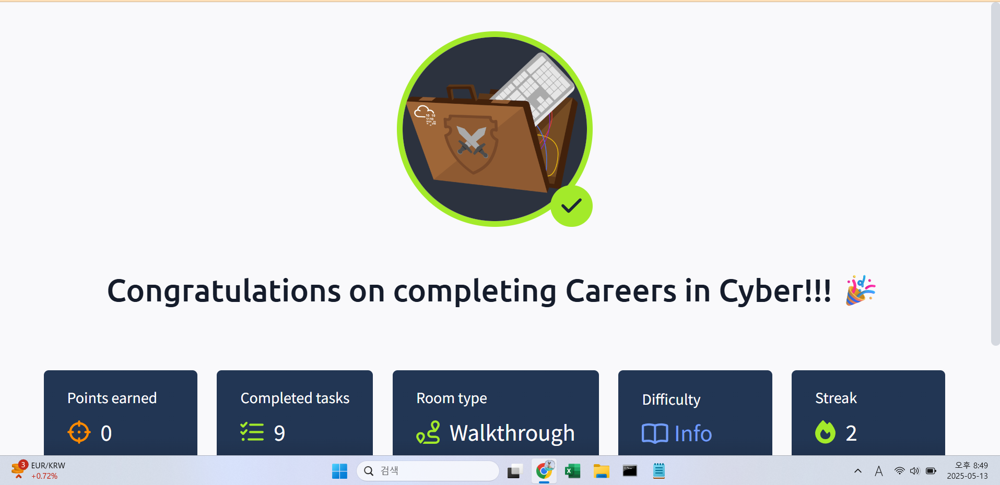

## TryHackMe: Careers in Cyber

## 실습 일시
- 2024-05-13

## 실습 주제
(1) Security Analyst
(2) Security Engineer
(3) Incident Responser
(4) Digital Forensics Examiner
(5) Malware Analyst
(6) Penetration Tester
(7) Red Teamer
(8) 나의 성향으로 보는 Careers in Cyber

## 사용 도구 및 명행령어

## 배운 점
- 해외 보안 직업들은 이렇게 고연봉을 받는다는 것을 처음 알았다.
- 내 성향으로는 Incident Responser가 어울린다고 나왔다.

## 느낀 점
-정보보안 쪽으로도 이렇게 세분화가 가능하다는 것을 보고 보안 공부가 재미없더라도 보안 쪽에 흥미가 없는 것이 아닌 아직 흥미 있는 보안 주제를 찾지 못한 것이라고 생각하게 된다.

## 실습 화면 기록

