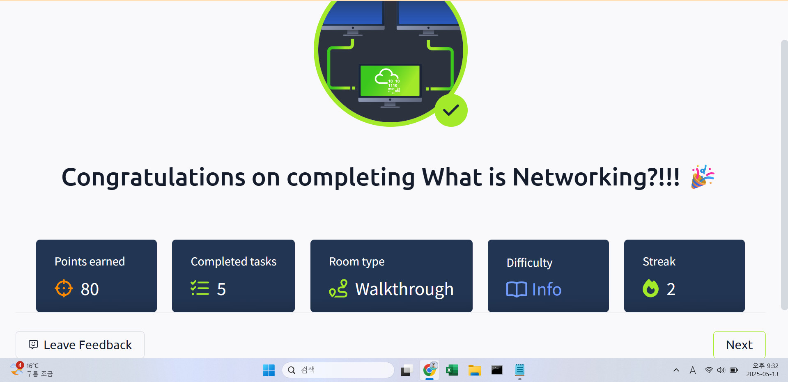

## TryHackMe: What is Networking?

## 실습 일시
- 2024-05-13

## 실습 주제
(1) What is Network?
(2) What is Internet?
(3) What is IP?수신시간
(4) PING

## 사용 도구 및 명행령어
ping IP Address(8.8.8.8) or Website URl

## 배운 점
- 네트워크는 하나의 관계이다. 취미 모임, 달리기 모임, 교통신호체계 전부 관계이자 하나의 네트워크이다. 단, 컴퓨터 공학에서의 네트워크는 그 관계가 컴퓨터나 핸드폰 등으로 정의된 것을 말한다.
- 인터넷이란 이런 소규모 네트워크들을 하나의 큰 네트워크로 묶는 시스템이다. network들을 이어주기에 public network로도 불린다.
- IP는 크게 Private IP와 Public IP로 나뉜다. 
- Private IP는 기기 자체에 등록되어 있는 IP로 기기 사이의 네트워크에서 서로를 구분하는 역할을 한다.
- Public IP는 소위 통신사(ISP, Internet Service Provider)가 사용자에게 부여하는 IP로 기기들이 전부 다를지라도 사용자가 같으면 Public IP가 같다.
- PING은 ICMP패킷을 이용하는 가장 기본적인 도구로 네트워크에 연결이 되어있는지 안되어있는지 패킷수신속도를 측정하여 연결속도를 알려주는 도구이다.

## 느낀 점
- 이론서로 요약한 개념이 아닌 풀어 쓴 글을 통해 학습하여 이해는 확실히 쉬웠다.
- 영어를 통해 공부하니 생각보다 진도가 나가지 않았다. 꾸준히 하면 좋아질 것 같다.
- 들어보고 외우는 것과 이해하는 것의 차이를 알았다.

## 실습 화면 기록

