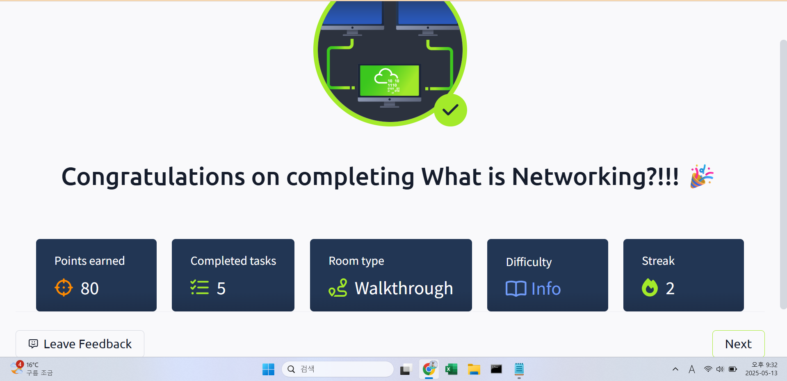

## TryHackMe: Intro to LAN

## 실습 일시
- 2024-05-14

## 실습 주제
(1) Introducing LAN Topologies
(2) A Primer on Subnetting
(3) ARP
(4) DHCP

## 사용 도구 및 명행령어

## 배운 점
(1) Introducing LAN Topologies
 - LAN(Local Area Network)는 여러 형태를 가진다.
 - Star topology : 중심부에 하나의 허브나 스위치를 두고 각 기기들이 중심부를 거쳐 통신을 하는 형태이다.
   - 중심부와 주변 기기들의 구분이 뚜렷하여 확장성이 뛰어나다.
   - 구축 비용이 비싸다.
   - 중앙집중형이기에 중심이 되는 허브나 스위치가 다운되거나 고장나면 네트워크도 다운된다.
 - Bus topology : 척추가 되는 케이블에 각 기기들이 연결되어 있는 형태이다. 나뭇가지와 가지에 달린 잎을 생각하면 편하다.
   - 성 형과 다른 점은 중심이 되는 기기가 없다는 것이다.
   - 보틀넥 현상이 있을 수 있다.
   - 하나의 케이블을 통해 네트워크의 모든 정보가 전달되기 때문에 많은 양의 데이터를 처리하기 어렵다.
 - Ring topology : 케이블과 기기들이 모여 원의 형태로 이어져 있는 형태이다.
   - 데이터 통신 시 중간에 있는 모든 기기들을 거치므로, 가까이 있는 기기들 간의 통신은 빠르나 멀리 떨어져 있는 기기들 간의 통신은 느리다.
   - 네트워크를 이루는 케이블이 잘리거나 기기 중 하나라도 다운된다면 더이상 정보를 전송하지 못한다.
 - Switch : 라우터와 기기들 사이에 네트워크들을 관리하는 허브로 효율적인 정보 전송이 가능하다.
 - Router : 데이터가 전송될 수 있는 통로를 만드는 기기로, 네트워크에 여러 기기들이 있을 때 전송되는 데이터가 길을 잃지 않도록 하는 표지판 역할을 한다.

(2) A Primer on Subnetting
 - 서브넷팅을 쉽게 표현하자면 하나의 케이크를 여러 사람에게 나눠주기 위해 조각을 내는 것이다.
 - 이때의 케이크를 네트워크로 생각하면 쉽다. 조각들의 구분은 서브넷 마스크라는 번호를 통해 구별한다.
 - Network Address : 네트워크의 시작을 구분해준다. 네트워크의 유무를 판단하는데 사용된다.
 - Host Address : 기기의 서브넷을 구분하는데 사용되는 IP이다.
 - Default Gateway : 네트워크에 소속된 기기에 부여되는 특별한 주소로, 다른 네트워크로 정보를 전송할 수 있다.

(3) ARP
 - ARP(Address Resolution Protocol) : IP주소를 바탕으로 MAC주소를 알아내는 프로토콜이다.
 - ARP Request를 통해 질문을 하고 ARP Reply를 받아 MAC주소를 알아낸다.

(4) DHCP
 - DHCP Discover : 나 IP 좀 줄 수 있어?
 - DHCP Offer : 좋아, IP(8.8.8.8) 줄게.
 - DHCP Request : 고마워, 나 이제부터 이 IP(8.8.8.8) 쓰기 시작할게.
 - DHCP ACK : 좋아, 그 IP는 앞으로 24시간 동안 쓸 수 있어. 
## 느낀 점
- 개념은 진작에 외우고 있었다. 하지만 풀어 쓴 글로 보니 이해하기가 정말 수월했다.
- 정보처리기사 공부할 때 본 내용이라 친숙한 느낌이 났다.
- 쉽사리 진도가 나가지 않아 조금 조급한 마음이다.

## 실습 화면 기록

