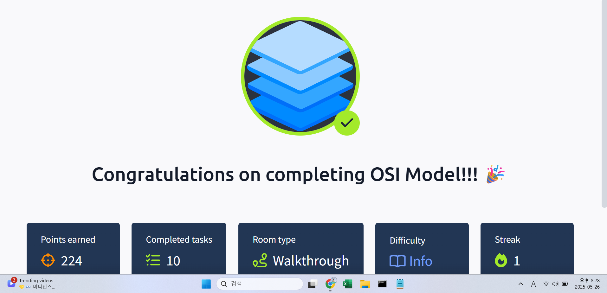

## TryHackMe: OSI Model

## 실습 일시
- 2024-05-26

## 실습 주제
(1) What is the OSI Model?
(2) Layer1 - Physical
(3) Layer2 - Data Link
(4) Layer3 - Network
(5) Layer4 - Transport
(6) Layer5 - Session
(7) Layer6 - Presentation
(8) Layer7 - Application
(9) Practical - OSI game

## 사용 도구 및 명행령어

## 배운 점
(1) What is the OSI Model?
 - Open Systems Interconnection Model의 약자로, 네트워킹에서 필수적인 모델이다.
 - 데이터들이 서로 어떻게 주고받았는지 어떻게 해석해야 하는지를 알 수 있게 해주는 프레임워크이다.
(2) Layer1 - Physical
 - 물리적인 디바이스로 구축되는 계층으로, 이더넷 케이블 등을 통해 정보를 주고받는다.
(3) Layer2 - Data Link
 - 네트워크 계층으로부터 원격 컴퓨터의 아이피 주소가 잇는 패킷을 받고, 엔드포인트의 물리적 MAC주소를 그 패킷에 더한다.
 - 데이터를 전송에 적합한 형태로 만든다.
(4) Layer3 - Network
 - 라우팅과 재조합을 담당하며, 데이터 청크들이 보내지는 최적의 길을 결정한다.
 - 최적의 길을 판단하기 위해 OSPF, RIP와 같은 라우팅 프로토콜을 이용한다.
 - IP주소를 기반으로 라우팅을 진행한다.
(5) Layer4 - Transport
 - 데이터가 네트워크를 통해 이동할 수 있게 하는 필수적인 역할을 한다.
 - 데이터가 전송될 때 사용되는 프로토콜로 TCP, UDP가 있다.
 - Transmission Control Protocol(TCP)는 두 기기간의 지속적인 연결을 제공하고, 오류검출을 수행한다. 주로 파일, 이메일 전송 과정에서 사용된다.
 - User Datasgram Protocol(UDP)는 TCP에 있는 많은 장점이 없는 대신 빠른 속도로 데이터를 전송한다는 장점이 있다.
(6) Layer5 - Session
 - 데이터가 목적으로 하는 다른 컴퓨터들과의 연결을 만들거나 유지한다.
 - 데이터들은 오직 주어진 세션을 통해서만 이동할 수 있다.
(7) Layer6 - Presentation
 - 각기 다른 프로그램이나 소프트웨어에서 받은 데이터의 표준화를 수행하는 계층이다. 일종의 번역기 역할이다.
(8) Layer7 - Application
 - 사용자와 직접 상호작용하는 계층으로 이메일이나 브라우저 등이다.
(9) Practical - OSI game
 - 재밌는 게임

## 느낀 점
- 이해가 쉽게 쉽게 되었다.

## 실습 화면 기록

