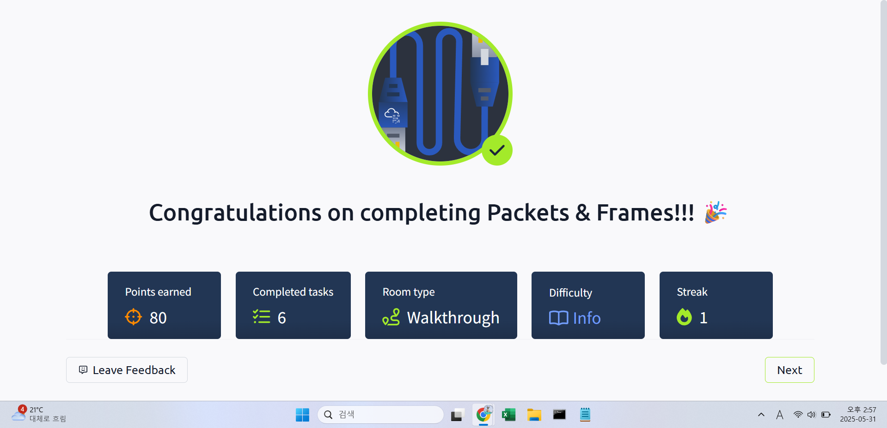

## TryHackMe: Packets&Frames

## 실습 일시
- 2024-05-28

## 실습 주제
(1) What are Packets and Frames?
 - 패킷과 프레임들은 데이터의 작은 조각으로서, 이것들이 뭉쳐 정보나 메시지의 큰 조각을 만든다.
 - 프레임은 데이터 링크 계층에 속해 있어 IP주소와 같은 정보가 없다.
 - 패킷은 네트워크로 연결된 기기들 간 의사소통을 할 수 있는 효율적인 방법이다.
 - 패킷은 작은 조각들로 이루어져 잇어 보틀넥 현상이 일어날 가능성이 적고 그에 따라 많은 양의 메시지를 한 번에 보낼 수 있다.
 - 패킷에는 패킷헤더가 있어 전송하는 데이터에 대한 다양한 정보를 담을 수 있다.

(2) TCP/IP (The Three-Way Handshake)
 - TCP/IP 프로토콜은 OSI모델과 비슷하지만 엄연히 다른 것으로 OSI모델의 요약본이라고 생각하면 쉽다.
 - 이 프로토콜은 크게 Application, Transport, Internet, Network Interface 4가지 계층으로 이루어져 있다.
 - 데이터 혹은 패킷은 이 계층들을 지나면서 전송된다. 이러한 과정을 캡슐화라고 하고, 그 반대를 decapsulation이라 한다.
 - TCP는 연결 지향인 프로토콜로, 데이터를 보내기 전에 반드시 각 기기들을 연결해야 한다. 이때 필요한 연결 과정을 Three-way handshake라 한다.
 - TCP 패킷들은 캡슐화 과정에서 헤더를 가져 다양한 정보(Source port, Destination Port, Sequence number 등)들을 가진다.
 - three-way handshaking 시에는 sequence number을 사용한다.
 - TCP연결을 끊을 시에는 FIN패킷을 송신해 종료를 알리고 그에 대한 대답인 ACK패킷을 수신한다.

(3) UDP/IP
 - UDP(User Datagram Protocol)은 두 기기 사이의 의사소통 시에 사용되는 프로토콜이다.
 - TCP와 달리 데이터 전송 시에 지속적인 연결 과정을 필요치 않는다. 그에 따라 데이터 전송에 대해 동기화를 하지 않는다. 데이터 무결성을 보장하지 않는다.
 - 연결을 선행하지 않기에 데이,터 전송 속도가 상대적으로 빠르다.
 - 데이터 유실이 용인되는 영상 스트리밍이나 보이스챗에서 사용된다.

## 사용 도구 및 명행령어
~$ nc 8.8.8.8 1234
- Source IP주소가 8.8.8.8인 데이터를 포트번호가 1234인 포트로 연결한다.    

## 배운 점
 - 패킷과 프레임들은 데이터의 작은 조각으로서, 이것들이 뭉쳐 정보나 메시지의 큰 조각을 만든다.
 - 프레임은 데이터 링크 계층에 속해 있어 IP주소와 같은 정보가 없다.
 - 패킷은 네트워크로 연결된 기기들 간 의사소통을 할 수 있는 효율적인 방법이다.
 - 패킷은 작은 조각들로 이루어져 잇어 보틀넥 현상이 일어날 가능성이 적고 그에 따라 많은 양의 메시지를 한 번에 보낼 수 있다.
 - 패킷에는 패킷헤더가 있어 전송하는 데이터에 대한 다양한 정보를 담을 수 있다.

## 느낀 점
- 패킷과 프레임에 대해 자세히 배울 수 있었다.

## 실습 화면 기록

