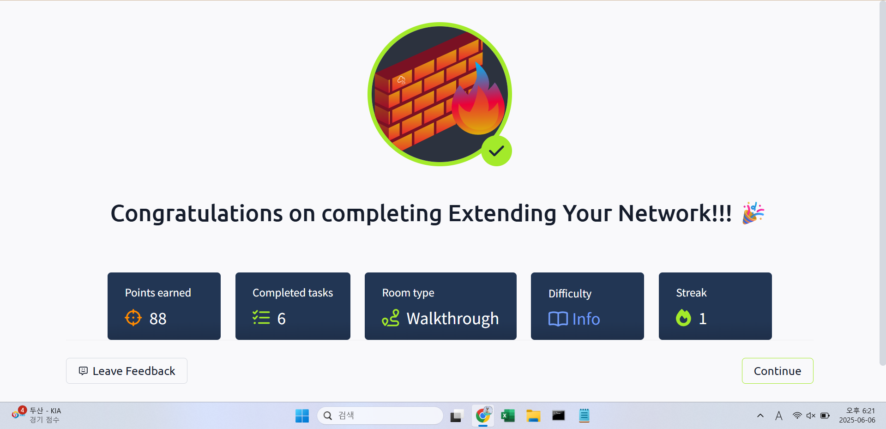

## TryHackMe: Extending Your Network

## 실습 일시
- 2024-06-06

## 실습 주제
(1) Introduction to Port Forwarding
 - 포트 포워딩은 애플리케이션과 서비스들을 인터넷에 연결하는데 필수적인 요소이다.
 - 포트 포워딩 없이 연결하려면 동일한 직접 네트워크만을 이용해야 한다.

(2) Firewalls 101
 - 방화벽은 네트워크에 들어오거나 네트워크로부터 나가는 트래픽을 허용할 것인지 차단할 것인지 판단하는 능력이 있는 도구이다.
 - 네트워크가 어디에서 오는지, 어디로 가는지, 어떤 포트를 거쳐서 오는지, 어떤 프로토콜을 사용하는지를 이용하여 판단한다.
 - 방화벽은 상태에 따라 2~5가지 범주로 나눌 수 있다.

(3) VPN Basics
 - Virtual Private Network(VPN)는 기기들이 안전하게 통신할 수 있게 기기 사이에 터널이라 부르는 신뢰된 경로를 만드는 기술이다. 이러한 터널을 통해 통신하는 기기들은 사설 네트워크를 가진다.
 - 네트워크가 가지는 지리적 한계를 극복할 수 있다.
 - 데이터를 보호하기 위해 터널을 이용할 때 데이터를 암호화하고, 사설망을 이용하기에 스니핑공격을 예방하여 뛰어난 보안성을 제공한다.
 - 그러한 특징으로 인해 뛰어난 익명성을 제공한다.
 - VPN의 종류로는 PPP(Point-to-Point Protocol), PPTP(Point-to-Point Tunneling Protocol), IP(Internet Protocol Security)가 있다.

(4) LAN Networking Devices m
 - 라우터는 네트워크를 연결하고 데이터를 지나가게 하는 역할을 한다. 이 과정을 라우팅이라 부른다.
 - 라우터는 OSI 모델 중 3계층에서 활동한다.
 - 라우터를 통해 만들어진 길들이 어떻게 선택되어지는지는 결정에 사용되는 알고리즘에 따라 다르다.
 - 스위치는 라우터와 달리 일대다 통신에서 주로 사용되며 2계층과 3계층에서 사용된다. 2계층에서 활용되는 스위치보다 3계층에서 활용되는 스위치가 더 정교하다.
 - VLAN(Virtual Local Area Netwok)는 가상의 네트워크를 만들어 네트워크를 분리해서 관리할 수 있게 한다. 이는 주로 관리 시에 분리된 네트워크가 통합된 네트워크보다 더 이점이 있을 시에 사용한다.

## 사용 도구 및 명행령어   

## 배운 점
 - 스위치와 라우터의 차이점에 대해서 알았다. 라우터는 주로 일대일 통신에서 쓰이고, 스위치는 주로 일대다 통신에서 쓰인다.
 - VLAN의 원리와 사용 목적에 대해 배웠다. VLAN은 주로 네트워크를 분리했을 때 관리 시 이점이 더 많다면 사용한다.

## 느낀 점
- 포트 포워딩에 대해서는 이번에 처음 배웠는데 자격증 공부에서 배우지 않았던 것을 배우니 참으로 흥미로웠다.

## 실습 화면 기록

