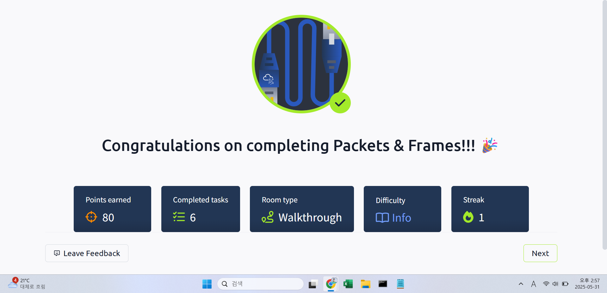

## TryHackMe: Extending Your Network

## 실습 일시
- 2024-05-31

## 실습 주제
(1) Introduction to Port Forwarding
 - 포트 포워딩은 애플리케이션과 서비스들을 인터넷에 연결하는데 필수적인 요소이다.
 - 포트 포워딩 없이 연결하려면 동일한 직접 네트워크만을 이용해야 한다.

(2) Firewalls 101
 - 방화벽은 네트워크에 들어오거나 네트워크로부터 나가는 트래픽을 허용할 것인지 차단할 것인지 판단하는 능력이 있는 도구이다.
 - 네트워크가 어디에서 오는지, 어디로 가는지, 어떤 포트를 거쳐서 오는지, 어떤 프로토콜을 사용하는지를 이용하여 판단한다.
 - 방화벽은 상태에 따라 2~5가지 범주로 나뉜다.

(3) VPN Basics
 - Virtual Private Network(VPN)는 기기들이 안전하게 통신할 수 있게 기기 사이에 터널이라 부르는 신뢰된 경로를 만드는 기술이다. 이러한 터널을 통해 통신하는 기기들은 사설 네트워크를 가진다.
 - 네트워크가 가지는 지리적 한계를 극복할 수 있다.
 - 데이터를 보호하기 위해 터널을 이용할 때 데이터를 암호화하고, 사설망을 이용하기에 스니핑공격을 예방하여 뛰어난 보안성을 제공한다.
 - 그러한 특징으로 인해 뛰어난 익명성을 제공한다.
 - VPN의 종류로는 PPP(Point-to-Point Protocol), PPTP(Point-to-Point Tunneling Protocol), IP(Internet Protocol Security)가 있다.
 - 
(4) LAN Networking Devices m

## 사용 도구 및 명행령어
~$ nc 8.8.8.8 1234
- Source IP주소가 8.8.8.8인 데이터를 포트번호가 1234인 포트로 연결한다.    

## 배운 점
 - 패킷과 프레임들은 데이터의 작은 조각으로서, 이것들이 뭉쳐 정보나 메시지의 큰 조각을 만든다.
 - 프레임은 데이터 링크 계층에 속해 있어 IP주소와 같은 정보가 없다.
 - 패킷은 네트워크로 연결된 기기들 간 의사소통을 할 수 있는 효율적인 방법이다.
 - 패킷은 작은 조각들로 이루어져 잇어 보틀넥 현상이 일어날 가능성이 적고 그에 따라 많은 양의 메시지를 한 번에 보낼 수 있다.
 - 패킷에는 패킷헤더가 있어 전송하는 데이터에 대한 다양한 정보를 담을 수 있다.

## 느낀 점
- 패킷과 프레임에 대해 자세히 배울 수 있었다.

## 실습 화면 기록

