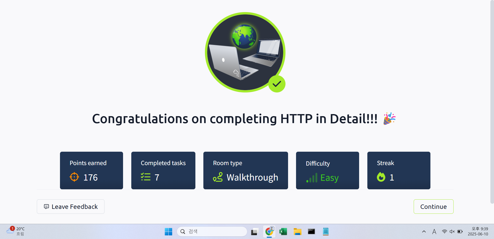

## TryHackMe: HTTP in Detail

## 실습 일시
- 2025-06-10

## 실습 주제
(1) What is HTTP(S)?
 - HTTP(HyperText Transfer Protocol)은 인터넷에서 의사소통하는데 필요한 일련의 규칙들의 집합으로, 이미지나 영상 파일, 웹페이지 파일들을 교환하는데 사용한다.
 - HTTPS(HyperText Transfer Protocol Secure)은 HTTP에서 보안 부분이 강화된 버전이다. 다른 사람이 훔쳐보지 않게 데이터를 암호화해주고, 연결된 웹사이트가 안전한 곳인지도 판단해준다.

(2) Requests And Responses
 - 우리가 웹사이트에 접속할 때, 우리의 브라우저는 웹서버에 웹사이트를 보기 위해 필요한 에셋들을 요청한다. 이떄 브라우저가 웹서버로부터 정확하게 정보를 받기 위해 URL을 사용한다.
 - URL(Uniform Resource Locator)은 인터넷에 접속하기 전에 사전에 정의된 규약으로 각 데이터가 어디에 위치해 있는지를 보여준다.
   1) Scheme : 자원에 대해 어떤 프로토콜을 사용하여 접속할 것인지를 정하는 규약이다.
   2) User : 인증이 필요한 서비스에 접속할 시 인증을 위해 유저명과 비림번호를 입력한다.
   3) Host : 접속하고자 하는 서버의 도메인 이름이나 IP주소를 나타낸다.
   4) Port : 접속하고자 하는 서버의 포트 번호이다.
   5) Path : 접속하고자 하는 자원의 이름이나 위치이다.
   6) Query String : 요청된 길로 보낼 수 있는 추가 비트이다.
   7) Fragment : 실제 요청된 페이지의 위치에 대한 레퍼런스이다.

(3) HTTP Methods
 - HTTP Method는 사용자가 HTTP요청을 만들 때 어떤 식으로 작동하도록 만들었는지 그 의도를 보여주는 방법이다.
   1) GET Request : 웹서버로부터 정보를 얻고자 할 때 사용한다.
   2) POST Request : 웹서버에 정보를 제공하거나 새로운 레코드를 만들 때 사용한다.
   3) PUT Request : 웹서버에 데이터를 주어 정보를 갱신하고자 할 때 사용한다.
   4) DELETE Request : 웹서버에 있는 정보나 레코드를 삭제할 때 사용한다.

(4) HTTP Status Codes
 - HTTP Status Code는 사용자의 HTTP요청의 결과가 어떻게 처리되는지를 알려주는 코드이다.

(5) Headers
 - 헤더는 웹서버로 향하는 요청을 생성할 때 붙일 수 있는 추가 비트이다.
 - 다음은 클라이언트가 서버로 요청을 보낼 때 사용하는 헤더들이다.
   1) Host : 몇몇의 웹서버들은 여러 개의 호스트를 가지고 있는데 이 헤더를 이용하여 어떤 호스트에 요청을 보내는지 구분한다.
   2) User-Agent : 사용자의 블라우저 정보를 서버에게 보내는 헤더로, 서버는 이 헤더를 통해 해당 브라우저에 맞는 정보를 제공한다.
   3) Content-Length : 웹서버에 데이터를 전송할 때 데이터의 크기를 알려주는 헤더로, 전송 중에 데이터가 유실되었는지 아닌지 확인하는데 도움을 준다.
   4) Cookie : 웹서버가 클라이언트의 정보를 기억하는데 도움을 주는 헤더이다.
 - 클라이언트가 서버에 요청을 한 후에 그에 대한 답변을 보낼 때 사용되는 헤더이다.
   1) Set-Cookie : 받은 요청에서 어떤 정보를 저장할 것인지를 알려주는 헤더
   2) Cache-Control : 받은 요청에 대한 캐시를 얼마나 오래 저장할 것인지를 알려주는 헤더
   3) Content-Type : 받은 요청에 대해 어떤 유형의 데이터를 돌려줄 것인지를 알려주는 헤더
   4) Content-Encoding : 인터넷을 통해 전송하기 위해 데이터를 작게 압축하는데 어떤 방식으로 압축하는지를 알려주는 헤더

(6) Cookies
 - 쿠키는 컴퓨터에 저장되어 있는 작은 데이터 조각으로 Set-Cookie 헤더를 받을 때 저장할 수 있다.
 - 쿠키는 당신이 한 웹서버에 자주 접속할 시 웹서버가 당신이 누구인지 상기하는데 도움을 준다.
 - 쿠키는 많은 곳에서 사용되지만 주로 사용자 인증에 사용된다.

(7) Making Requests 
 - HTTP Request 실습

## 사용 도구 및 명행령어   
(1) Make a GET Request to /room page
 GET /room HTTP/1.1
 Host:tryhackme.com
 User-Agent:Mozilla/5.0 Firefox/87.0
 Content-Length:0

 HTTP/1.1 200 OK
 Server:nginx/1.15.8
 Tue, 10 Jun 2025 21:28:10 GMT
 Content-Length:252
 Last-Modified:Tue, 10 Jun 2025 21:28:10 GMT

 <html>~</html>

 
## 배운 점
 - 리퀘스트 헤더에 대해 확실히 배웠다.
 - 리퀘스트 메소드에 대해서 그들이 어떤 용도로 쓰이는지 확실히 배웠다.

## 느낀 점
- HTTP Request에 대해서는 교재로만 배웠었다. 그렇기에 정보보안기사 실기 문제를 풀었을 때는 원리를 모르고 그저 암기만 했기에 풀지 못하였다.
- 3학년 때 캡스톤 프로젝트에서 웹페이지를 만들 때 조원이 작성하던 json파일을 보고 이해하지 못했는데 지금이라면 이해할 수 있을 것 같다.
- 이렇게 하나의 주제에 대해 시간을 들여 깊게 배우니 기억에도 잘 남는 것 같다.

## 실습 화면 기록

