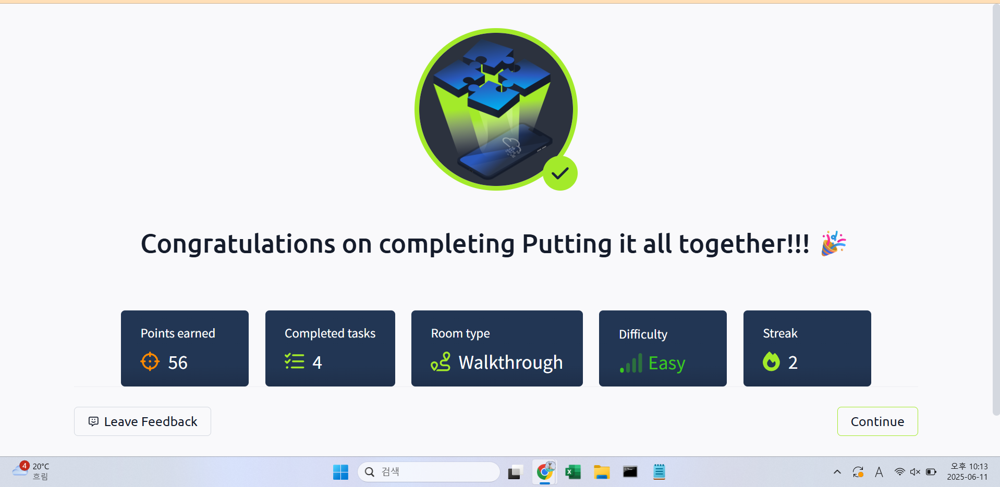

## TryHackMe: Putting it all together

## 실습 일시
 - 2025-06-11

## 실습 주제
(1) Putting It All Together
 - 지금까지의 요약

(2) Other Components
  1) Load Balancers : 큰 트래픽을 가지고 있는 응용프로그램을 처리할 때, 웹서버는 그에 맞는 가용성을 필요로 한다.
                      트래픽이 웹서버가 감당할 수 없는 정도로 많을 때 웹서버는 트래픽을 처리하지 못한다.
                      Load Balancer는 이러한 높은 트래픽의 웹사이트들을 처리하는데 도움을 준다. 또한, 웹서버가 올바르게 작동되고 있는지 주기적으로 확인하는 health check기능이 있다.
  2) CDN(Content Delivery Networks) : 바쁜 웹사이트의 트래픽을 줄여주는 훌륭한 도구이다.호스트하고 있는 서버가 여러 개이고, 그중 한 서버에 트래픽이 몰릴 때 다른 호스트 서버에 그 요청을 보낸다.
  3) Databases : 웹사이트가 사용자에 대한 정보를 저장할 때 이용하는 도구로, 웹서버는 데이터베이스를 정보를 저장하거나 불러올 수 있다.
  4) WAF(Web Application Firewall) : 웹요청과 웹서버 사이에 잇는 것으로 주 목적은 해킹이나 DoS공격으로부터 웹서버를 지키는 것이다.
                                     웹서버로 들어오는 트래픽을 조절하는 역할도 한다.

(3) How Web Servers Work
 - 웹서버는 다가오는 연결에 HTTP 프로토콜을 적용한 후 사용자가 원하는 정보를 사용자에게 전달하는 기능을 가진 소프트웨어이다. 정보는 주로 루트 디렉터리에 저장한다.
 - 웹서버는 각기 다른 이름을 가진 여러 개의 웹사이트들을 호스트할 수 있는데 이를 구현하기 위해 가상 호스트가 필요하다. 가상 호스트의 루트 디렉터리는 하드 드라이브에 매핑되어 있다. 가상 호스트를 이용한 호스팅 수의 한계는 없다.
 - 백엔드는 프로그래밍이나 스크립팅 언어를 부르는 말로, 무대 뒤에서 이루어지고 사용자가 HTML로 볼 수 없기에 백엔드이다. PHP도 백엔드이다.
 - 프론트엔드는 HTML로 사용자의 브라우저가 웹사이트를 접속할 때 보여지는 부분이다.

## 사용 도구 및 명행령어   
 
## 배운 점
 - 로드 밸런서, CDN에 대해 배웠다.
 - 오늘 배운 것은 개념적인 것으로 실습에 큰 도움이 될 것이라고는 생각하지 않는다.

## 느낀 점
 - 총복습 느낌으로 모듈을 진행했는데 기억이 안 나는 부분이 좀 있었다. 이래서 복습복습 하나보다
 - 평소 공부하면서 배웟던 내용이 아니라 좀 생소할 수 있는 개념을 배우게 되니 신선했다.
 - 복습이 정말 중요하다고 느낀다. 그에 따라 실습도 꾸준히 해야한다는 것을 느낀다.

## 실습 화면 기록

