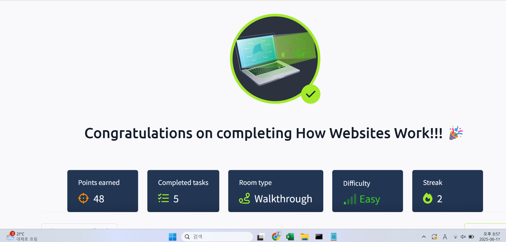

## TryHackMe: Linux Fundamentals Part 1

## 실습 일시
 - 2025-06-14

## 실습 주제
(1) Introduction 
 - 리눅스는 유닉스를 기반으로 한 커맨드 라인 운영 시스템으로 우리에게 익숙한 맥이나 윈도우 정도는 아니지만 가장 인기있는 운영체제 중 하나이다.
 - 리눅스는 생소한 것과는 다르게 스마트 자동차 ,슈퍼 컴퓨터, 가전 기기 등 다양한 곳에서 사용된다.

(2) A Bit of Background on Linux
 - 리눅스나 윈도우나 각각의 장점과 단점이 있다. 리눅스는 윈도우에 비해 가볍다.
 - 리눅스는 오픈소스로 널리 퍼져있다. 그 중 가장 유명한 것은 Ubuntu&Debian 이다. 우분투는 확장성이 좋아서 가장 흔한 배포판 중 하나가 되었다.

(3) Interacting With Your First Linux Machine (In-Browser)
 - 리눅스 가상 머신 생성

(4) Running Your First few Commands
 - 우분투 같은 가상머신들은 가볍다는 장점이 있지만 그 장점들로 인해 단점들도 존재한다.
 - 가성머신은 GUI(Graphical User Interface)가 아닌 CLI(Command Line Interface)로 이루어져 있다.
 - 그렇기에 대부분의 의사소통은 테스트 기반인 터미널을 통해 이루어진다.
 - 가장 기본적인 명령어
   1) echo : 우리가 원하는 출력값 전부를 보여준다.
   2) whoami : 현재 사용자가 무엇으로 로그인했는지를 보여준다.

(5) Interacting With the Filesystem
 - 로그인과 관련 있는 명령어
   1) ls : listing, Listing Files in Our Current Directory
   2) cd : change diretory
   4) cat : concatenate
   5) pwd : print working directory

(6) Searching for Files

(7) An Introduction to Shell Operators

(8) Conclusions & Summaries

## 사용 도구 및 명행령어   
 - ~$ enter commands here : Command 'enter' not found, did you mean:
 - ~$ echo Hello : Hello
 - ~$ echo "Hello Friend!" : Hello Friend!
 - ~$ whoami : tryhackme
 - ~$ ls : access.log folder1

 
## 배운 점
 - 민감 정보 노출이나 HTML Injection에 대한 개념은 정보보안기사를 준비하면서 알긴 알았었다. 알았지만 실기 문제는 풀 수 없었다.
 - 이렇게 실습을 해보니 실기 문제를 어떻게 풀어야 할지 감이 잡힌 느낌이다.

## 느낀 점
 - 이렇게 실습을 하고 개념들을 배워보니 내가 한걸음 한걸음씩 나아가는 느낌이 든다.
 - 기사 공부로 내가 시간을 날리고 있다고 생각하고 있었는데 이렇게 실습일지를 하나씩 남기고 있으니 알찬 느낌이 든다.
 - 오늘 이렇게 배운 내용들 특히 HTML Injection부분은 내가 훗날 일을 하고 문제에 직면했을 때 생각날 것 같다.

## 실습 화면 기록

