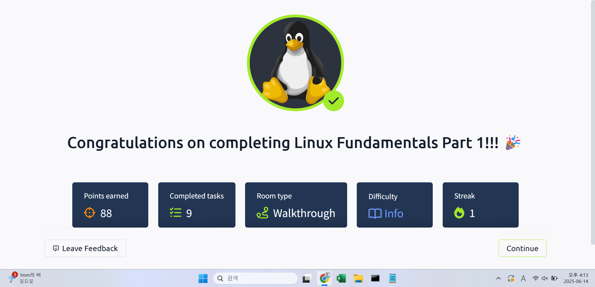

## TryHackMe: Linux Fundamentals Part 2

## 실습 일시
 - 2025-06-14

## 실습 주제
(1) Introduction 
 - 이번 모듈에서 배울 것
   1) 플래그들과 규약들을 사용하여 몇몇의 중요한 명령어들 배우기
   2) 파일 복사나 파일 이동과 같은 실용적인 명령어들을 배우면서 파일시스템에 대한 이해도 높이기
   3) 관리되고 있는 파일이나 폴더들에 대해 어떻게 접근하고 어떻게 접근을 구별할 것인지 알아내기

(2) Accessing Your Linux Machine using SSH (Deploy)
 - 이번에는 내 컴퓨터에 가상 머신을 만들어서 실습을 할 것이 아니라 SSH(Secure SHell)을 이용한 원격 가상머신으로 실습할 것이다.
 - SSH(Secure SHell)은 간단히 말하자면 기기 간 데이터 전송 시 데이터를 암호화한 형태로 바꿔주는 프로토콜이다. 인터넷을 떠도는 데이터의 보안성을 높인다. 
(3) Introduction to Flags and Switches
 - 리눅스 가상 머신 생성

(4) Filesystem Interaction Continued
 - 우분투 같은 가상머신들은 가볍다는 장점이 있지만 그 장점들로 인해 단점들도 존재한다.
 - 가성머신은 GUI(Graphical User Interface)가 아닌 CLI(Command Line Interface)로 이루어져 있다.
 - 그렇기에 대부분의 의사소통은 테스트 기반인 터미널을 통해 이루어진다.
 - 가장 기본적인 명령어
   1) echo : 우리가 원하는 출력값 전부를 보여준다.
   2) whoami : 현재 사용자가 무엇으로 로그인했는지를 보여준다.

(5) Permissions 101
 - 로그인과 관련 있는 명령어
   1) ls : listing, Listing Files in Our Current Directory
   2) cd : change diretory, 명령어를 입력하는 폴더를 바꾼다.
   4) cat : concatenate, 파일을 읽고 그 파일의 내용을 출력한다.
   5) pwd : print working directory, 현재 사용자가 작업하고 있는 디렉터리 경로를 출력한다.

(6) Common Diretories
 - ls, cd 명령어는 하나하나 찾아보고 가는 것이기에 비효율적이다. 이러한 단점을 극복한 명령어가 find이다. find 명령어는 이러한 과정을 자동화해준다.
 - 파인드 명령어는 찾고자 하는 파일이 조건에 맞을 수 있도록 적당한 조건을 두고 그 조건에 해당하는 파일들을 전부 찾아 보여준다.
 - grep 명령어도 find 명령어와 같이 굉장히 유용한 명령어로, find와 다른 점은 이름이나 파일 형식에 조건을 두는 것이 아니라 파일 안의 내용에 대해 조건을 걸 수 있다는 것이다.
 - 그렇기에 grep 명령어는 주로 로그파일을 분석할 시 사용된다.

(7) Conclusions and Summaries
 - Linux Operators(연산자)
   1) & : 터미널에서 사용자의 명령어가 실행될 수 있게 한다.
   2) && : 터미널에서 여러 개의 명령어를 한 줄로 같이 처리할 수 있게 해준다.
   3) > : 일종의 리디렉터로, cat 명령어와 동일한 결과를 갖게 해준다. 인덱스 느낌이다.
   4) >> : > 명령어와 동일한 역할로, 다른 점은 대체가 아닌 첨가에 가까운 느낌이란 것이다. 인덱스인 것은 동일한데 기존의 인덱스를 덮어쓰는 것이 아니라 인덱스를 추가하는 느낌이다.

## 사용 도구 및 명행령어   
 - ~$ enter commands here : Command 'enter' not found, did you mean:
 - ~$ echo Hello : Hello
 - ~$ echo "Hello Friend!" : Hello Friend!
 - ~$ whoami : tryhackme
 - ~$ ls : access.log folder1 folder2 folder3 folder4
 - ~$ mv folder1 ImportantFiles : change folder1 name to ImportantFiles
 - ~$ cd ImportantFiles : change directiory ~/ImportantFiles$
 - ~$ cat todo.txt : Here's something important for me to do later!
 - ~$ pwd : /home/tryhackme/Pictures
 - ~$ find -name passwords.txt : ./folder1/passwords.txt
 - ~$ find -name *.txt : ./folder1/passwords.txt, ./Documents/todo.txt
 - ~$ grep "81.143..211.90" access.log : 81.143.211.90 - - [25/Mar/2021:11:17 + 0000] "GET/HTTP/1.1" 200 417 "-" "Mozilla/5.0 (Linux; Android 7.0; Moto G(4))"
 - ~$ echo Hello > World
 
## 배운 점
 - 리눅스에 대해 아주 기초적인 명령어들을 중심으로 얇고 넓게 배웠다.
 - 터미널에서 예를 들면서 어떻게 명령어들을 쓰고 파일시스템을 이해해야 할지를 배웠다.

## 실무 적용 가능성
 - 보안 실무에서 리눅스 서버 로그 분석, 계정 탐색, 파일 추적에 grep과 find는 필수적이다.
 - 리눅스 환경에 익숙해지는 것은 침해 분석, 포렌식, 서버 보안 설정 등 거의 모든 보안 실무의 기반이 된다.

## 느낀 점
 - 리눅스에 대한 실습은 처음이어서 많이 신선했다. 학교나 프로젝트를 할 때는 리눅스를 쓸 일이 없어서 이번이 처음이었는데 은근 재밌었던 것 같다.
 - 정보보안기사 실기를 준비하는데 리눅스 실습에 대한 내용이 많이 나왔다. 하지만 나는 리눅스 실습을 한 적이 없어서 해설을 봐도 이해가 가지 않았다. 하지만 지금이라면 이해할 수 있을 것 같다.
 - 실무에서는 리눅스를 많이 사용한다고 하는데 내가 잘 적응할 수 있을지 모르겠다. 그래도 이대로만 가면 잘 할 수 있을 거라는 생각이 들기도 한다.

## 실습 화면 기록

