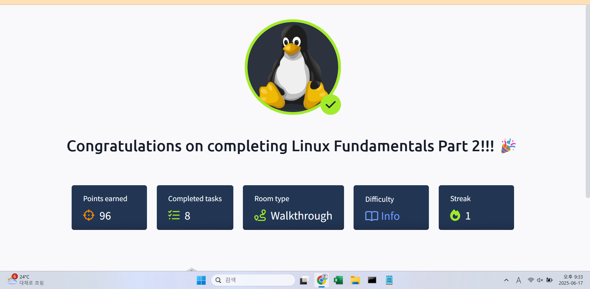

## TryHackMe: Linux Fundamentals Part 3

## 실습 일시
 - 2025-06-18

## 실습 주제
(1) Introduction 
 - 공부하거나 일하면서 계속 사용할 것 같은 유틸리티나 응용프로그램을 배운다.
 - automation, package management 그리고 service/application logging을 배우면서 리눅스에 대한 지식을 넓히겠다.

(2) Deploy Your Linux Machine
 - 리눅스 가상머신과 공격 가상 머신 실행
 - ssh tryhackme@10.10.228.107 ## tryhackme : 사용자 계정명, 10.10.228.107 : 가상 리눅스 머신 주소

(3) Terminal Text Editors
 - nano : 터미널에서 사용 가능한 텍스트 에디터.  이 텍스트 에디터가 더 진화하면 VIM이라고 불린다.
 - VIM : nano에서 진화한 텍스트 에디터로, 키보드 커스텀이 가능하고 텍스트 하이라이트 등 심화된 기능들을 사용할 수 있다.

(4) General/Useful Utilities
 - wget : 브라우저에서 파일을 다운받는 것처럼 HTTP프로토콜을 사용하여 웹에서 파일을 다운로드할 수 있게 하는 유틸리티이다.
 - wget을 사용하려면 다운로드 받고 싶은 파일의 정확한 주소를 알아야 한다.
 - SCP(Secure Copy) :  cp명령어와 비슷하지만 그것에서 암호화와 인증 과정을 추가하여 보안성을 높인다.
 - web : 터미널을 통하여 디렉터리나 파일을 웹에 업로드한다. 이때의 업로드는 파이선을 사용한다.

(5) Processes 101
 - 프로세스는 컴퓨터에서 실행되고 잇는 프로그램으로 커널에 의해 관리된다. 각 프로세스들은 PID라는 고유 아이디를 가지고 있다.
 - pid가 1인 프로세스는 부팅 과정에서 생성된 프로세스이다. 그 뒤로 프로세스는 발생 순서에 따라 순차적인 pid를 가진다.
 - ps : 프로세스를 보여주는 명령어로 프로세스에 대한 pid, status code와 같은 여러 정보들을 출력한다.
 - top : 프로세스의 통계적 정보를 출력한다.
 - kill : 프로세스를 갈제종료시키는 명령어이다. 몇몇의 시그널을 가진다.
   1) SIGTERM : 프로세스는 죽이고 클린업도 진행한다.
   2) SIGKILL : 프로세스는 죽이되, 클린업하지 않는다.
   3) SIGSTOP : 프로세스를 중단한다.
 - systemctl : systemd 프로세스나 데몬에 접속할 수 있는 명령어이다. 사용 방법은 systemctl [option] [service] 이다.
 - fg :  백그라운드에 있는 프로세스를 프론트로 가져오는 명령어이다.

(6) Maintaining Your System:Automation
 - Crontab : 부트 과정 시 생성되는 프로세스 중 하나로, cron job을 용이하게 하고 관리하는 역할을 한다. 6개의 특정 값을 가진다.
   1) MIN : 언제 실행됐는지 분으로 표시
   2) HOUR : 언제 실행됐는지 시로 표시
   3) DOM : 언제 실행됐는지 일로 표시 
   4) MON : 언제 실행됐는지 월로 표시
   5) DOW : 언제 실행됐는지 요일로 표시
   6) CMD : 실제 실행될 명령어를 표시
 - *를 사용할 수 있다. crontab -e 명령어를 통해 편집 가능하다.

(7) Maintaining Your System:Package Management
 - 개발자가 소프트웨어를 커뮤니티에 제출할 때 'apt' 저장소의 형태로 제출한다. 만약 문제가 없다면 그때는 대중에게 배포된다.
 - add-apt-repository : 저장소를 추가할 때 사용하는 명령어이다.
 - 나머지 apt key에 대한 부분은 이해가 안되는 관계로 다음 기회가 있을 때 보자

(8) Maintaining Your System:Logs
 - 기존 파트1에서 우리들은 로그에 대해 간단히 배웠다. /var/log 디렉터리에서 시스템에서 실행되는 파일과 폴더에 대한 로그에 대한 정보를 저장한다.
 - 운영체제는 이러한 로그 파일들을 잘 관리하는데 이러한 운영체제의 행위를 'rotating'이라 한다.
 - 이번에 우리들은 크게 3가지 서비스에 집중할 것이다.
   1) An Apache2 web Server
   2) Logs for the fail2ban sevice, 무작위 대입 공격을 관리할 때 이용 가능
   3) The UFW sevice, 방화벽에 사용
 - 이 세 서비스와 로그들은 시스템 보안에서 큰 역할을 담당한다.

(9) Conclusions&Summaries
 - 지금까지의 요약약

## 사용 도구 및 명행령어   
 - 리눅스 가상머신 접속
   1) ssh tryhackme@10.10.1.233 ## tryhackme : 사용자 계정명, 10.10.1.233 : 리눅스 가상머신 주소 -> 그냥 사용자 로그인 생각하면 이걸로 하
 - nano myfile : 파일 이름이 "myfile"인 파일을 터미널에서 텍스트 작업이 가능하도록 한다. 테그스트 찾기나 복사 같은 메모장에서 할 수 있는 어지간한 일은 전부 할 수 있다.
 - scp filename.type browsername@IpAddress:/filedirectory : 브라우저를 통해 해당 디렉터리에 있는 파일을 다운로드한다.
 - web을 이요한 파일 업로드와 다운로드 과정
   1) python3 -m http.server
   2) wget http://10.10.228.107:8000/myfile.txt
   3) scp myfile.txt ubuntu@10.10.228.107
  - ps : 프로세스에 대한 여러 정보들을 출력한다.
  - ps aux : 사용자의 프로세스 뿐만 아니라 다른 사용자의 프로세스의 정보까지도 출력한다.
  - kill 1377 : 프로세스 아이디가 1377인 프로세스를 강제종료시킨다.
## 배운 점
 - 원격 리눅스 머신 접속 방법, 명령어에 붙여 사용하는 플래그들, 리눅스 디렉터리에는 어떤 것들이 있는지 배웠다.
 - 명령어들은 전 모듈에서 배웠고 이번에는 플래그들을 배웠는데 각 명령어마다 사용할 수 있는 플래그들이 달라 배우는데 재미가 있었다.
 - su 명령어를 통한 사용자 계정 전환에 대해 배웠는데 정보보안기사 실기에서 봤던 내용이라 복습을 하는 느낌이 들었다.

## 실무 적용 가능성
 - 만약 내가 일하는 회사에서 리눅스를 사용한다면 오늘 배운 명령어들이나 플래그들은 전부 쓸 것 같다.
 - 하나의 서버를 두고 여러 사용자가 서버에 대한 작업을 한다면 계정 전환을 할 상황이 생길텐데 그러면 su명령을 쓰지 않을까 생각한다.
 - 각각의 루트 디렉터리들도 로그 파일이나 사용자에 대한 정보를 찾을 때 사용할 것 같다. 

## 느낀 점
 - 리눅스에 대해 본격적으로 배우니 그동안 의문이었던 것들이 조금씩 풀리는 느낌이 들었다.
 - 특히 su 명령과 같은 명령어들은 실습을 하지 않으면 이해하기가 어려워서 기사 실기 준비시 이해가 되지 않았었는데 오늘 일지를 정리하면서 해결의 실마리가 보였다.
 - 리눅스 가상머신을 사용하여 실습을 하니 실무를 하는 느낌이 들어 미래 그리고 취업에 대한 불안감이 약간 줄어들었다. 

## 실습 화면 기록

