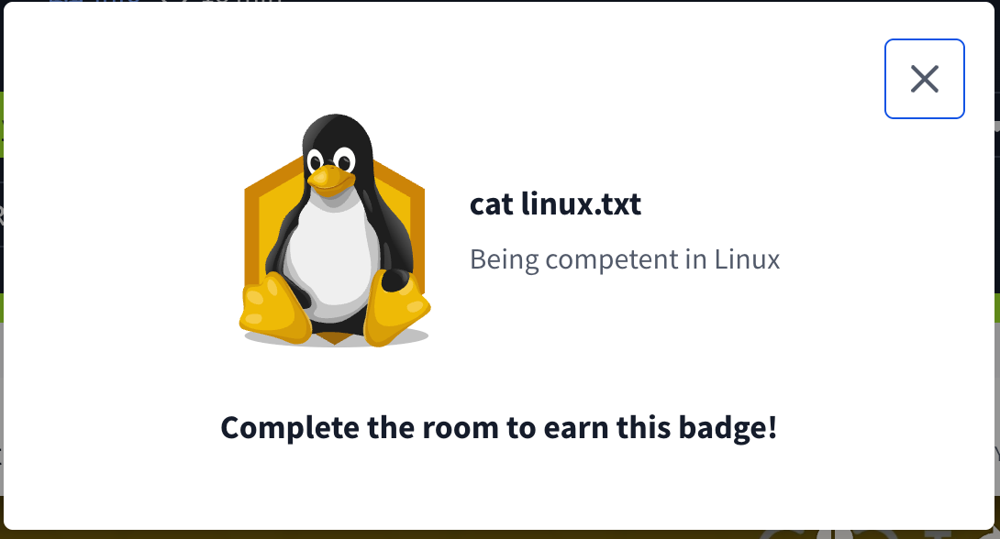

## TryHackMe: Windows Fundamentals 1

## 실습 일시
 - 2025-06-28

## 실습 주제
(1) Introduction to Windows 
 - 이번 학습 모듈에서는 윈도우 운영체제에 대한 전반적인 지식을 학습할 것이다.
 - 이번 학습은 사용자가 윈도우를 더 편하게 이용하는 것을 목표로 하고 있다.
 - 윈도우 가상머신 실행 

(2) Windows Editions
 - 마이크로소프트사는 윈도우 XP, Vista 등 많은 명작들을 남기고 현재는 10, 11을 운용하고 있다.
 - 윈도우의 역사

(3) The Desktop(GUI)
 - 윈도우 운영체제는 GUI(Graphical user Interface)를 위주로 한 상호작용 방식을 채택하고 있다.
 - 윈도우에 대한 간단한 설명과 사용법(검색, 바탕화면 변경 등)

(4) The File System
 - 현재 윈도우 운영체제에서 사용하는 파일 시스템은 NTFS(New Technology File System)이다.
 - NTFS 이전에는 FAT16/FAT32(File Allocation Table)과 HPFS(High Performance File System)을 사용하였다.
 - NTFS의 큰 장점 중 하나는 로그파일에 저장되어 있는 정보들을 사용하여 자동으로 디스크에 있는 파일이나 폴더들을 복구해준다는 것이다.
 - NTFS의 특징 중 하나는 파일과 폴더에 관해 여러 가지 권한을 부여하거나 뺏어올 수 있다. 그 권한의 종류는 다음과 같다.
   1) Full control
   2) Modify
   3) Read & Execute
   4) List folder contents
   5) Read
   6) Write
 - 다른 특징으로는 ADS(Alternate Data Streams)가 있다.
 - ADS는 NTFS의 특별한 속성 중 하나로, 데이터에 추가 데이터 스트림을 부여할 수 있다.

(5) The Windows/System32 Folders
 - 윈도우 폴더는 전형적으로 윈도우 운영체제에 대한 정보들이 담겨있는 폴더로 알려져 있다.
 - 시스템 환경 변수에 관한 정보들은 %windir% 디렉토리에 담겨있다.
 - 운영체제 시스템에 필요한 중요한 정보들을 담는 폴더는 System32 폴더이다. 이 폴더의 내용이 삭제되거나 올바르지 않게 변한다면 운영체제 시스템은 잘 작동하지 않게 된다.

(6) User Accounts, Profiles and Permissions
 - 사용자 계정은 크게 Administrators & Standard User가 있다.
 - 계정 유형에 따라 권한이 달라지면서 파일이나 폴더의 변경, 삭제 등에 관해 취할 수 있는 선택지가 달라진다.

(7) User Account Control
 - Crontab : 부트 과정 시 생성되는 프로세스 중 하나로, cron job을 용이하게 하고 관리하는 역할을 한다. 6개의 특정 값을 가진다.
   1) MIN : 언제 실행됐는지 분으로 표시
   2) HOUR : 언제 실행됐는지 시로 표시
   3) DOM : 언제 실행됐는지 일로 표시 
   4) MON : 언제 실행됐는지 월로 표시
   5) DOW : 언제 실행됐는지 요일로 표시
   6) CMD : 실제 실행될 명령어를 표시
 - *를 사용할 수 있다. crontab -e 명령어를 통해 편집 가능하다.

(8) Settings and the Control Panel
 - 개발자가 소프트웨어를 커뮤니티에 제출할 때 'apt' 저장소의 형태로 제출한다. 만약 문제가 없다면 그때는 대중에게 배포된다.
 - add-apt-repository : 저장소를 추가할 때 사용하는 명령어이다.
 - 나머지 apt key에 대한 부분은 이해가 안되는 관계로 다음 기회가 있을 때 보자

(9) Task Manager
 - 기존 파트1에서 우리들은 로그에 대해 간단히 배웠다. /var/log 디렉터리에서 시스템에서 실행되는 파일과 폴더에 대한 로그에 대한 정보를 저장한다.
 - 운영체제는 이러한 로그 파일들을 잘 관리하는데 이러한 운영체제의 행위를 'rotating'이라 한다.
 - 이번에 우리들은 크게 3가지 서비스에 집중할 것이다.
   1) An Apache2 web Server
   2) Logs for the fail2ban sevice, 무작위 대입 공격을 관리할 때 이용 가능
   3) The UFW sevice, 방화벽에 사용
 - 이 세 서비스와 로그들은 시스템 보안에서 큰 역할을 담당한다.

(10) Conclusion
 - 지금까지의 요약

## 사용 도구 및 명행령어   
 - 리눅스 가상머신 접속
   1) ssh tryhackme@10.10.1.233 ## tryhackme : 사용자 계정명, 10.10.1.233 : 리눅스 가상머신 주소 -> 그냥 사용자 로그인 생각하면 이걸로 하자.
 - nano myfile : 파일 이름이 "myfile"인 파일을 터미널에서 텍스트 작업이 가능하도록 한다. 테그스트 찾기나 복사 같은 메모장에서 할 수 있는 어지간한 일은 전부 할 수 있다.
 - scp filename.type browsername@IpAddress:/filedirectory : 브라우저를 통해 해당 디렉터리에 있는 파일을 다운로드한다.
 - web을 이요한 파일 업로드와 다운로드 과정
   1) python3 -m http.server
   2) wget http://10.10.228.107:8000/myfile.txt
   3) scp myfile.txt ubuntu@10.10.228.107
  - ps : 프로세스에 대한 여러 정보들을 출력한다.
  - ps aux : 사용자의 프로세스 뿐만 아니라 다른 사용자의 프로세스의 정보까지도 출력한다.
  - kill 1377 : 프로세스 아이디가 1377인 프로세스를 강제종료시킨다.

## 배운 점
 - 리눅스 터미널 안에서 실행할 수 있는 파일 텍스트 편집기인 nano, VIM에 사용법에 대해서 전반적으로 배웠다. 
 - wget와 scp 명령어를 배워 리눅스 터미널을 통한 간단한 파일 업로드와 다운로드를 행할 수 있게 되었다.
 - 이론적으로만 접해봤던 프로세스의 정보를 터미널을 통해 직접적으로 확인할 수 있게 되었다.
 - Crontab에 대한 기본적인 정보들을 전반적으로 배웠다.

## 실무 적용 가능성
 - 이번 모듈에서 배운 리눅스 명령어들은 빈번한 빈도로 실무에서 쓸 것 같다.
 - 만약 회사에서 리눅스를 사용한다면 오늘 배운 것들은 한 번 더 살펴봐야 할 것 같다.

## 느낀 점
 - 오늘은 리눅스 학습에 대한 마지막 챕터라서 그런지 한 번만 보면 이해가 되지 않는 내용들이 있었다. 그 중 apt key에 대한 내용은 좀 많이 어려웠다.
 - 이렇게 리눅스 학습을 하니 리눅스마스터 2급 자격증을 한 번 도전해볼까 하는 생각이 들었다. 이 정도 난이도면 할 만할 것 같다.
 - 이번 모듈의 내용은 다른 모듈보다 방대했는데 많은 정보를 영어로 학습하려니 피로도가 빨리 누적되었다. 그래도 영어 실력이 늘어난다고 생각하니 꾸준히 할 수 있었던 것 같다.

   
## 실습 화면 기록

