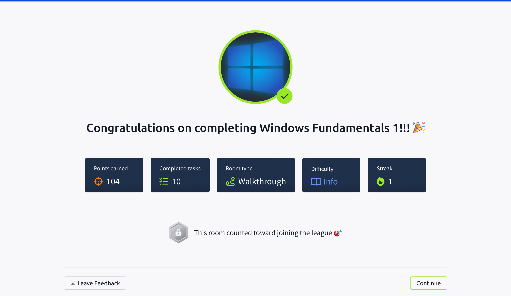

## TryHackMe: Windows Fundamentals 1

## 실습 일시
 - 2025-06-28

## 실습 주제
(1) Introduction to Windows 
 - 이번 학습 모듈에서는 윈도우 운영체제에 대한 전반적인 지식을 학습할 것이다.
 - 이번 학습은 사용자가 윈도우를 더 편하게 이용하는 것을 목표로 하고 있다.
 - 윈도우 가상머신 실행 

(2) Windows Editions
 - 마이크로소프트사는 윈도우 XP, Vista 등 많은 명작들을 남기고 현재는 10, 11을 운용하고 있다.
 - 윈도우의 역사

(3) The Desktop(GUI)
 - 윈도우 운영체제는 GUI(Graphical user Interface)를 위주로 한 상호작용 방식을 채택하고 있다.
 - 윈도우에 대한 간단한 설명과 사용법(검색, 바탕화면 변경 등)

(4) The File System
 - 현재 윈도우 운영체제에서 사용하는 파일 시스템은 NTFS(New Technology File System)이다.
 - NTFS 이전에는 FAT16/FAT32(File Allocation Table)과 HPFS(High Performance File System)을 사용하였다.
 - NTFS의 큰 장점 중 하나는 로그파일에 저장되어 있는 정보들을 사용하여 자동으로 디스크에 있는 파일이나 폴더들을 복구해준다는 것이다.
 - NTFS의 특징 중 하나는 파일과 폴더에 관해 여러 가지 권한을 부여하거나 뺏어올 수 있다. 그 권한의 종류는 다음과 같다.
   1) Full control
   2) Modify
   3) Read & Execute
   4) List folder contents
   5) Read
   6) Write
 - 다른 특징으로는 ADS(Alternate Data Streams)가 있다.
 - ADS는 NTFS의 특별한 속성 중 하나로, 데이터에 추가 데이터 스트림을 부여할 수 있다.

(5) The Windows/System32 Folders
 - 윈도우 폴더는 전형적으로 윈도우 운영체제에 대한 정보들이 담겨있는 폴더로 알려져 있다.
 - 시스템 환경 변수에 관한 정보들은 %windir% 디렉토리에 담겨있다.
 - 운영체제 시스템에 필요한 중요한 정보들을 담는 폴더는 System32 폴더이다. 이 폴더의 내용이 삭제되거나 올바르지 않게 변한다면 운영체제 시스템은 잘 작동하지 않게 된다.

(6) User Accounts, Profiles and Permissions
 - 사용자 계정은 크게 Administrators & Standard User가 있다.
 - 계정 유형에 따라 권한이 달라지면서 파일이나 폴더의 변경, 삭제 등에 관해 취할 수 있는 선택지가 달라진다.

(7) User Account Control
 - 보통 사용자들은 주로 로컬 관리자의 형태로 로그인한다.
 - 관리자의 형태로 로그인되기에 시스템 폴더에 대한 권한이 있어 자칫 사용자가 멀웨어에 감염되면 시스템 전체에 큰 해를 입게된다.
 - 이를 방지하기 위해 마이크로소프트사는 UAc(User Account Control)를 발표하였다. 이 개념은 Vista에서 처음 공개되었다.
   
(8) Settings and the Control Panel
 - 윈도우 세팅과 그와 비슷한 컨트롤 패널 활성법
   
(9) Task Manager
 - 작업 관리자에 대한 간단한 내용이다. 

(10) Conclusion
 - 지금까지의 요약

## 사용 도구 및 명행령어   
 - 윈도우에 대한 기본적인 내용들만 배워서 사용 도구는 따로 없었다.

## 배운 점
 - 이번에 NTFS에 대해서 배웠는데 로그파일의 정보들을 이용하여 디스크에 있는 폴더, 파일들을 복구해준다는 것을 처음 배웠다.
 - ADS에 대해서 처음 배웠는데 간단히 말하면 이것이 데이터의 유용성을 증가시킨다는 것을 배웠다.
 - User Account Control의 등장배경이 멀웨어로부터 시스템을 지키는 것임을 배웠다.

## 실무 적용 가능성
 - 윈도우에 대한 기본적인 내용을 이론적으로만 배우는 모듈이기에 실무에서는 크게 유용할 것 같지 않다.

## 느낀 점
 - 평소에 쓰던 윈도우를 조금 전문적으로 배우니 새로운 느낌이 들었다.
 - 윈도우 운영체제가 얼마나 잘 짜여진 운영체제인지 새삼 깨달았다.

   
## 실습 화면 기록

