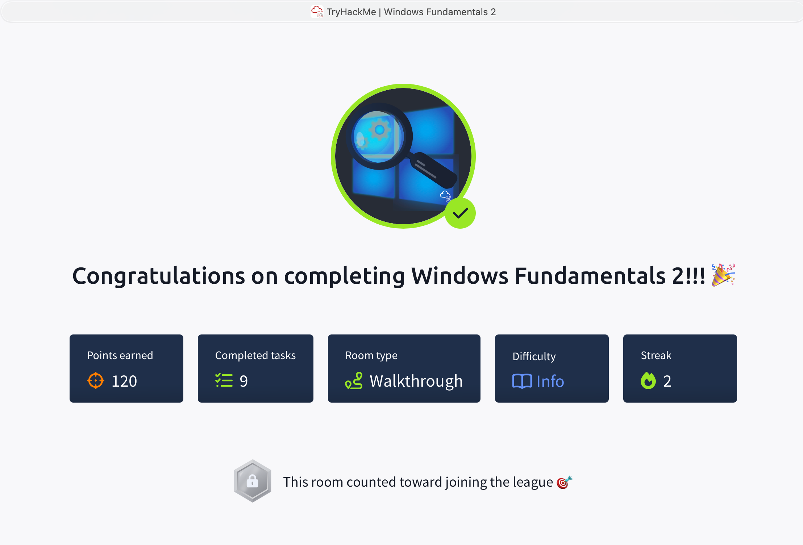

## TryHackMe: Windows Fundamentals 2

## 실습 일시
 - 2025-07-01

## 실습 주제
(1) Introduction
 - 데스크탑, 파일 시스템, 사용자 계정 제어, 컨트롤 패널, 작업 관리자에 대해 배운다.
 - 평소에 접해봤던 유틸리티에 대한 새로운 접속 방법에 대해 다룰 것이다.

(2) System Configuration
 - System Configuration utility(MSconfig) : 트러블슈팅을 위해 개선되었고, 주 목적은 시작 시에 문제가 있을 시 문제를 진단하는 데에 있다. 이 프로그램을 열면 다섯 개의  메뉴가 있다.
   1) General : 윈도우 부트 시 어떤 장치의 어느 서비스를 로드할 것인지를 정할 수 있다.
   2) Boot : 운영체제에 대한 다양한 부트 옵션을 정의할 수 있다.
   3) Services : 백그라운드에서 실행되거나 중지된 모든 서비스들의 목록을 보여준다.
   4) Startup : 작업 관리자로 시작 아이템을 활성화할지 안 할지를 결정하는 메뉴이다.
   5) Tools : 사용할 수 있는 다양한 유틸리티의 목록을 보여준다. 각 툴의 간단한 요약을 보여준다.
  
(3) Change UAC Settings
 - System Configuration에서 User Account Control(UAC) 세팅을 바꾸거나 아예 끌 수 있다.

(4) Computer Management
 - Computer Management(compmgmt) : 크게 3가지 섹션이 있다.
   1) System Tools : 크게 5가지 툴이 있다.
      a) Task Scheduler : 특정한 시간에 컴퓨터가 작업을 수행하도록 일정을 만들거나 관리할 수 있다.
      b) Event Viewer : 컴퓨터에서 일어나는 이벤트를 볼 수 있게 해준다. 주로 문제가 발생했는지 유무를 판별하는데 사용한다.
      c) Shared Folders : 타인과 연결된 공유나 공유 폴더를 볼 때 사용한다.
      d) Local Users and Groups : 유저와 그룹 사용자를 보여준다.
      e) Performance : Preforamnce Monitor(perform)을 통해 로그파일을 살펴봄으로써 이상이 발생했을 때 트러블슈팅에 많은 도움을 준다.
   2) Storage : Storage에는 Windows Server backup과 Disk Management가 있는 데 그 중 후자를 살펴보겠다.
      a) Disk Management : 윈도우가 하는 스토리지 작업을 개선할 수 있게 하는 시스템 유틸리티이다.
   3) Services and Applications : 백그라운드에서 실행되는 서비스들의 상태를 확인하고 활성화할지 안 할지를 결정할 수 있다.  

(5) System Information
 - System Information(msinfo32) : 컴퓨터 이상 확인시 사용할 수 있는 하드웨어, 시스템 구성, 소프트웨어 환경 정보 등을 모으는 도구이다.
   1) Hardware Resources : 보통의 사용자들은 알 필요가 없다.
   2) Components : 컴퓨터에 설치된 하드웨어 정보들을 볼 수 있다.
   3) Software Environment : 운영체제에서 설치하거나 사용자가 설치한 소프트웨어에 관한 정보들을 볼 수 있다.
   
(6) Resource Monitor
 - Resource Monitor(resmon) : CPU사용량, 램 사용량 등 작업을 수행하는데 필요한 자원 사용량을 보여준다.
 - 컴퓨터 시스템에 대한 트러블슈팅을 다루고자 하는 사용자들이 주로 사용할 수 있다.
 - 이 유틸리티는 크게 4가지 메뉴가 있다.
   1) CPU : 현재 실행 중인 작업별 CPU 사용량을 보여준다.
   2) Disk : 현재 실행 중인 작업별 Disk 사용량을 보여준다.
   3) Network : 현재 실행 중인 작업별 Network 사용량을 보여준다.
   4) Memory : 현제 실행 중인 작업별 Memory 사용량을 보여준다.

(7) Command Prompt
 - Command Prompt(cmd) : 우리가 리눅스에서 했던 터미널과 같이 윈도우의 명령어 실행기이다.
   1) hostname : 컴퓨터 이름을 출력한다.
   2) whoami : 현재 로그인한 사용자의 이름을 출력한다.
   3) ipconfig : 컴퓨터의 네트워크 세팅에 관한 정보를 출력한다.
   4) /? : 명령어에 쓸 수 있는 옵션들에 대해 알려준다.
   5) cls : cmd 창을 초기화한다.
   6) netstat : 프로토콜의 통계적 정보와 현재 연결된 TCP/IP 네트워크를 보여준다.
   7) net : 주로 네트워크 리소스를 관리하는데 사용한다. 
   
(8) Registry Editor
 - Windows Registry : 중앙 계층적 데이터베이스로, 여러 사용자에 대한 필수적인 시스템 정보(프로파일, 시스템에 잔존하는 하드웨어 등)들을 저장하는데 사용한다.
 - Window Registry를 보는 방법 중 하나가 Registry Editor(regedit)이다.  
   
(9) Conclusion
 - 이제까지의 요약

## 사용 도구 및 명행령어   
 - cmd 명령어
   1) hostname : 컴퓨터 이름을 출력한다.
   2) whoami : 현재 로그인한 사용자의 이름을 출력한다.
   3) ipconfig : 컴퓨터의 네트워크 세팅에 관한 정보를 출력한다.
   4) /? : 명령어에 쓸 수 있는 옵션들에 대해 알려준다.
   5) cls : cmd 창을 초기화한다.
   6) netstat : 프로토콜의 통계적 정보와 현재 연결된 TCP/IP 네트워크를 보여준다.
   7) net : 주로 네트워크 리소스를 관리하는데 사용한다. 
   

## 배운 점
 - System Configuration(MSconfig)에 대해서 처음으로 배웠다. 
 - MSconfig를 통해 여러 유틸리티들을 실행하는 방법을 배웠다.
 - 여러 유틸리티들 중 중요한 유틸리티(System Information, Resource Monitor, Command Prompt 등)의 읽는 법과 사용법을 배웠다.
   

## 실무 적용 가능성
 - 윈도우 백그라운드에서 실행되는 작업을 여러 툴을 사용해 활용하는 법을 배웠다. 툴들의 목적은 대부분 트러블슈팅이었는데, 만약 내가 운영체제로 윈도우를 사용하고 주업무가 시스템 이상탐지라면 오늘 배운 내용들을 잘 사용할 것 같다.
 - Command Prompt에 대한 간단한 명령어를 배우고 실습을 진행했는데 이런 간단한 명령어라도 실무에서는 요긴하게 쓰일 것 같다.

## 느낀 점
 - 학교에서 한 번도 배워보지 않은 것을 배우다보니 알고 있는 것이 늘어난다는 기분 좋은 느낌을 받았다.
 - 가까운 미래에 내가 오늘 배운 유틸리티들을 사용하면서 일을 한다고 생각하니 열심히 배워야겠다고 생각했다.
 - 한편으로는 잘 할 수 있을까라는 생각이 든다.

   
## 실습 화면 기록

