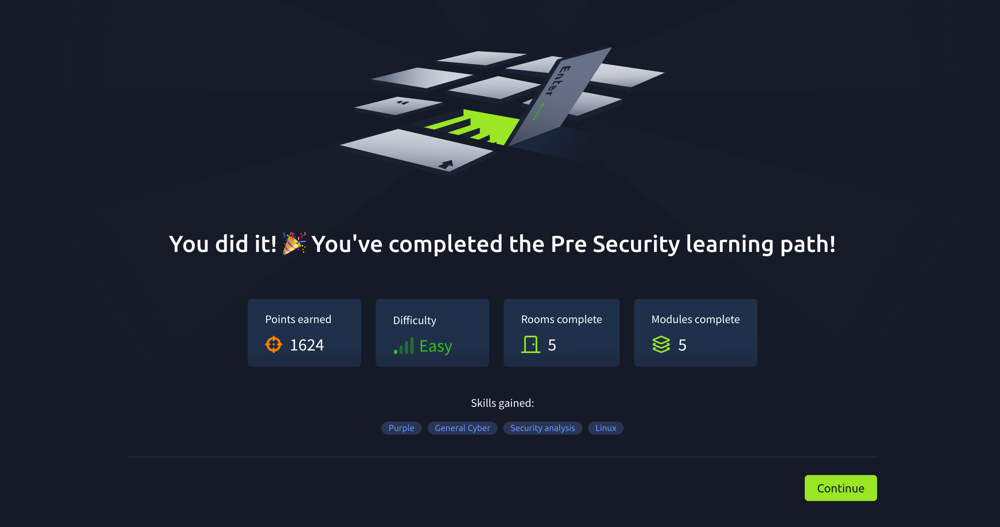
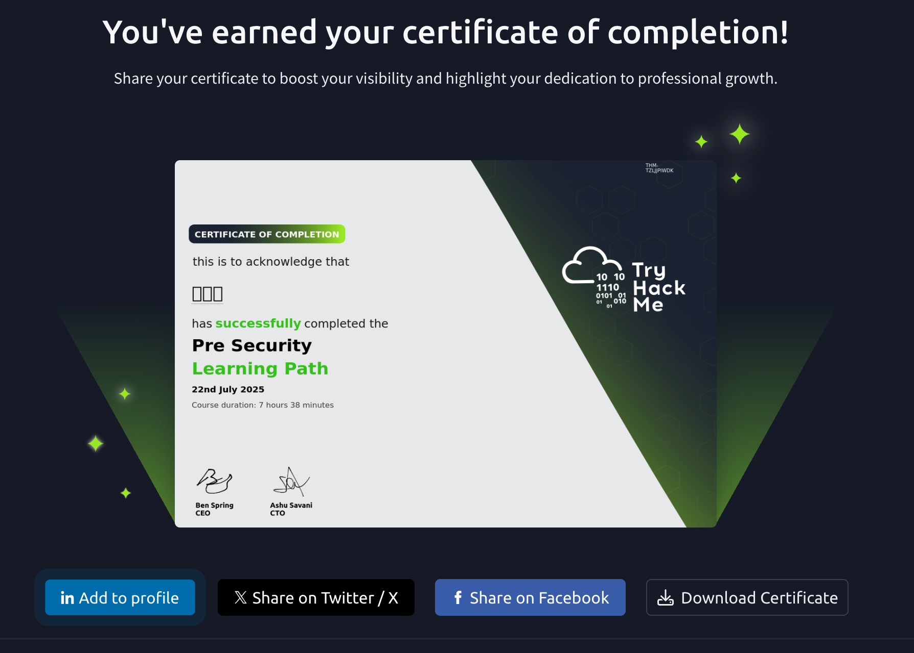

## TryHackMe: Windows Fundamentals 3

## 실습 일시
 - 2025-07-02~22

## 실습 주제
(1) Introduction
 - 이번 모듈에서는 윈도우 운영체제의 보안적 특징들에 대해 전반적으로  살펴볼 것이다.

(2) Windows Updates
 - 윈도우는 보안 상의 이유나 기능 개선, 예기치 못한 문제가 발생했을 때 업데이트를 진행하여 문제를 해결한다.
 - 윈도우에 급한 업데이트가 있을시 업데이트를 필수로 한다.
   
(3) Windows Security
 - 사용자의 기기나 데이터를 관리할 수 있는 도구들이 모여있다.
 - 보안 부분에서 색에 따라 의미하는 것이 다르다.
   1) 초록색은 사용자의 기기가 충분히 보호되고 있다는 것을 의미한다.
   2) 노란색은 검토해야할 필요가 있다고 검사를 권고하는 색이다.
   3) 빨간색은 경고의 의미로 즉각적인 조치가 필요하다는 것을 의미한다.

(4) Virus&threat protection
 - 윈도우에는 3가지 스캔 옵션이 있다.
   1) Quick scan : 통상적으로 위협이 발견되었던 폴더들만 체크한다. 
   2) Full scan : 하드디스크에서 실행되고 있는 모든 파일과 프로그램들을 검사한다.
   3) Custom scan : 검사하고 싶은 폴더들만 골라 검사한다.

(5) Firewall&network protection
 - 방화벽 : 방화벽이란 포트를 통해 데이터가 들어오는데 들어오는 데이터에 조건을 걸어 사용자가 허용하는 데이터만 교환될 수 있도록 하는 일종의 경비원이다.
 - 방화벽에는 3종류의 프로파일이 있다.
   1) Domain : 호스트 시스템이 도메인 컨트롤러에게 권한을 줄 수 있게끔 하는 프로파일이다.
   2) Private : 사용자가 지정한 프로파일로 프라이빗, 홈 네트워크를 디자인할 수 있게 한다.
   4) Public : 디폴트 설정인 프로파일로 와이파이 핫스팟이나 커피숍 같은 공공장소에서 사용한다.
   
(6) App&browser control
 - Microsoft Defender SmartScreen : 피싱이나 멀웨어로부터 사용자 기기를 보호한다.
 - Microsoft Defender SmartScreen는 웹에서 받은 인식되지 않은 파일이나 앱을 검사함으로써 기기 보호를 돕는다.  

(7) Device security
 - 메모리 무결성은 높은 차원에서의 악의적 코드 삽입 공격을 예방한다.
 - TPM(Trusted Platform Module) : 하드웨어 베이스의 안전 기술로 TPM칩은 암호적 업무들을 수행할 수 있다.
 - 이 칩은 물리적으로 다중 보안 메커니즘을 가지기에 악의적 소프트웨어로부터 높은 보안성을 지닌다. 
   
(8) BitLocker
 - BitLocker : 운영체제와 위협에 노출된 데이터의 주소를 합친 것을 특징으로 하는 데이터 보안이다.
 - 사용자 기기에 TPM이 설치되었다면 비트로커는 최고의 보안을 제공한다.
   
(9) Volume Shadow Copy Service
 - Volume Shadow Copy Service(VSS) : 앞으로 백업될 데이터의 스냅샷을 만드는데 필요하다.
 - System Volume Information 폴더에 저장된다.
   
(10) Conclusion
 - 이제까지의 요약

## 사용 도구 및 명행령어   
 - 윈도우의 기본적인 부분을 배우는 것이기에 이번 장에서는 명령어를 사용하지 않았다. 
   

## 배운 점
 - 윈도우 스캔 옵션이 3가지나 있다는 것을 배웠고 그 중 Quick scan에서 검사할 폴더의 선정 기준이 이제까지 위협이 자주 발생했는가 인지는 처음 배웠다.
 - 방화벽에서 3가지의 프로파일에 대해 처음 배웠다.
 - VSS나 스마트 스크린 같이 생소한 윈도우 기능들에 대해 간단히 배웠다.

## 실무 적용 가능성
 - 오늘은 윈도우 설정 중에서 업데이트와 보안 부분에 대해 간략하게 배웠다.
 - 내가 오늘 배운 것을 실무에서 쓸까 생각하면 오늘 배운 내용들이 너무 얕아 쓰지는 않을 것 같다.
 - 그래도 업데이트로 한정 지으면 전문적 업무가 아닌 간단한 사무 업무에서 사용할 것 같기는 하다.

## 느낀 점
 - 3주 만에 하는 실습이다. 그동안 너무 해이해져 있었다. 너무 혼자서만 오래 공부한 탓일까 아무것도 하기가 싫었다.
 - 내가 과연 이 길을 가는 것이 맞을까, 자격증 시험에 합격할 수 있을까, 취업을 할 수 있을까, 시간을 버리고 있는 것이 아닌가 등 여러 생각이 들었다.
 - 이 장을 마지막으로 기본 장이 종료가 되었는데 이것을 내가 다 끝냈다는 생각에 조금의 성취감을 느꼈다.

   
## 실습 화면 기록

